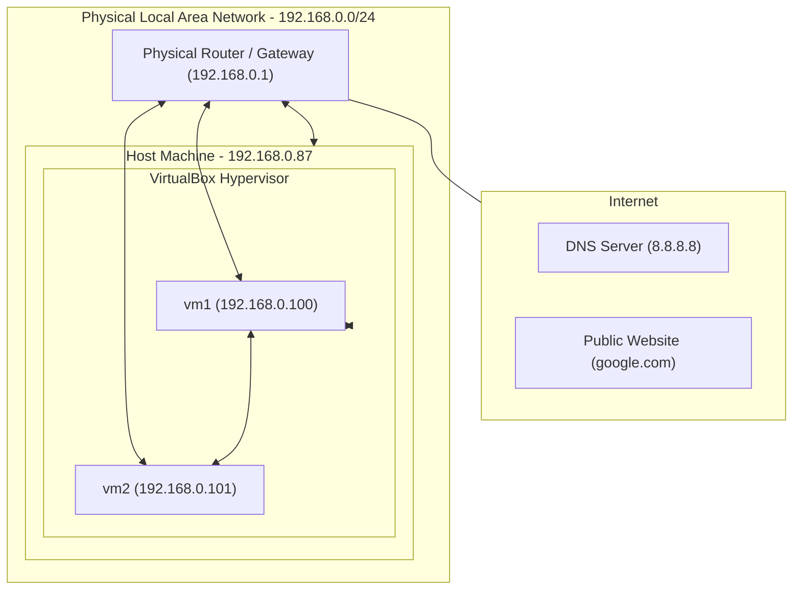

# VirtualBox Network Mode: Bridged

## Goal

Understand how the **Bridged** network mode works in VirtualBox. Unlike NAT, Bridged mode makes the virtual machine a full, independent member of your physical local area network (LAN). This lab uses the [Vagrantfile](./Vagrantfile) to demonstrate how VMs interact directly with your physical router and other devices in your network.

## Summary of Bridged Mode

In Bridged mode, VirtualBox uses a device driver on your host system that intercepts data from the physical network and injects data into it. This creates a virtual network interface in the VM that is "bridged" to your physical card (Wi-Fi or Ethernet).

**Key Characteristics:**

- The VM appears as a separate physical computer to your router.
- The VM obtains an IP address directly from your physical network's DHCP server (e.g., `192.168.1.x`).
- The VM is fully accessible from the host and other devices on your LAN.
- The VM has its own independent gateway to the internet (the same one your host uses).

## Key Learning Objectives

- Understand the "Pure Bridged" setup versus the setup using multiple adapters (NAT + Bridged).
- Learn how to manage default gateway priorities in Vagrant.
- Validate:
  - Physical LAN IP addressing.
  - Direct inbound connectivity from the host.
  - Transparent inter-VM communication via the physical network.

## Network Topology (VirtualBox Bridged Mode)



## Prerequisites

- [VirtualBox](https://www.virtualbox.org/wiki/Downloads)
- [Vagrant](https://developer.hashicorp.com/vagrant/install)

## The Vagrantfile [Configuration](./Vagrantfile)

This lab uses a dual-adapter configuration to satisfy Vagrant's operational requirements while achieving the objective of a Bridged environment.

The [Vagrantfile](./Vagrantfile) is structured as follows:

1.  **Management Adapter (NIC 1)**: A NAT interface required by Vagrant for SSH connectivity and management tasks.
2.  **Bridged Adapter (NIC 2)**: The primary interface for this lab, connected directly to your physical network.
3.  **Routing Configuration**: The setting `use_dhcp_assigned_default_route: true` is applied to the Bridged interface. This ensures that the default gateway provided by your physical router takes precedence in the routing table, allowing the VM to communicate with the internet as a peer on your local network rather than through the NAT engine.

## Setup

Two Debian VMs provisioned with Vagrant and running on VirtualBox.

## Foundational Experiments

Bridged mode builds upon the fundamental networking concepts established in the NAT lab. Before exploring Bridged-specific behavior, it is recommended to review the [essential experiments in the NAT lab](../NAT/README.md#some-basic-experiments), which provide the technical basis for:

- **Network Interface Configuration**: Checking assigned IPv4 addresses and interface status.
- **Outbound Connectivity**: Testing internet access via ICMP and package managers.
- **Routing and Neighbors**: Inspecting the kernel routing table and ARP table.
- **Vagrant Operations**: Reviewing SSH configuration and file transfer commands.

The following experiments focus on the unique characteristics of Bridged mode, demonstrating how the VM interacts directly as a peer on the physical network.

### 1. Verifying the Bridged Gateway

Unlike the NAT lab where the gateway is always `10.0.2.2`, in Bridged mode, the gateway is your physical router.

Run `ip route` and observe that the `default` line now points to your local network.

```bash
vagrant@vm1:~$ ip route
default via 192.168.0.1 dev eth1
10.0.2.0/24 dev eth0 proto kernel scope link src 10.0.2.15
192.168.0.0/24 dev eth1 proto kernel scope link src 192.168.0.100
```

### 2. Inbound Connectivity (The "True" Bridge Test)

In NAT mode, your host cannot reach the VM's internal IP. In Bridged mode, it can.

1.  Find the IP of `vm1` on the `eth1` interface.
2.  **From your physical host machine**, try to ping that IP directly:

```bash
ping -c3 192.168.0.100
PING 192.168.0.100 (192.168.0.100) 56(84) bytes of data.
64 bytes from 192.168.0.100: icmp_seq=1 ttl=64 time=0.506 ms
64 bytes from 192.168.0.100: icmp_seq=2 ttl=64 time=0.244 ms
64 bytes from 192.168.0.100: icmp_seq=3 ttl=64 time=0.266 ms

--- 192.168.0.100 ping statistics ---
3 packets transmitted, 3 received, 0% packet loss, time 2080ms
rtt min/avg/max/mdev = 0.244/0.338/0.506/0.118 ms
```

### 3. Discovering the Local Network

Because the VM is a full member of your LAN, it can see other devices (phones, printers, other PCs).

Try to ping another device on your home network (like your host's LAN IP):

```bash
vagrant@vm1:~$ ping <host-lan-ip>
PING 192.168.0.87 (192.168.0.87) 56(84) bytes of data.
64 bytes from 192.168.0.87: icmp_seq=1 ttl=64 time=0.238 ms
64 bytes from 192.168.0.87: icmp_seq=2 ttl=64 time=0.256 ms
64 bytes from 192.168.0.87: icmp_seq=3 ttl=64 time=0.233 ms

--- 192.168.0.87 ping statistics ---
3 packets transmitted, 3 received, 0% packet loss, time 1999ms
rtt min/avg/max/mdev = 0.233/0.242/0.256/0.009 ms
```

### 4. Inter-VM Communication via LAN

In this lab, `vm1` and `vm2` talk to each other through your physical router, not through a virtual internal switch.

From `vm1`, ping `vm2` using its physical LAN IP:

```bash
vagrant@vm1:~$ ping <vm2-physical-ip>
PING 192.168.0.101 (192.168.0.101) 56(84) bytes of data.
64 bytes from 192.168.0.101: icmp_seq=1 ttl=64 time=0.731 ms
64 bytes from 192.168.0.101: icmp_seq=2 ttl=64 time=0.568 ms
64 bytes from 192.168.0.101: icmp_seq=3 ttl=64 time=0.454 ms

--- 192.168.0.101 ping statistics ---
3 packets transmitted, 3 received, 0% packet loss, time 1999ms
rtt min/avg/max/mdev = 0.454/0.584/0.731/0.113 ms
```

> **Note on Hostname Resolution:** You will notice that `ping vm2` (by name) fails. In NAT mode, VirtualBox provides a built-in DNS that knows VM names. In Bridged mode, you are using your physical router for DNS, which does not know about Vagrant hostnames. You must use IP addresses for peer communication.

### 5. Hosting a Real Network Service (The "External" Test)

Bridged mode makes the VM accessible to any device on your Wi-Fi/Ethernet.

1.  **Start a web server in vm1:**
    ```bash
    vagrant@vm1:~$ python3 -m http.server 8080
    ```
2.  **Access from an external device:** Open a web browser on your **actual smartphone** or another PC on the same network and navigate to `http://<vm1-physical-ip>:8080`.
3.  **Proof:** If the page loads, it proves the VM is a "first-class citizen" on your physical network, reachable without any host port forwarding.
    Indeed, the page served can be accessed in a browser running on the host, or in a smatphone in the same network, using, e.g, the url `http://192.168.0.100:8080`

### 6. Discovering Physical Neighbors (ARP Table)

Since the VM is "on the wire," it can see the MAC addresses of your physical hardware.

1.  **Prime the table:** The ARP table is dynamic. Ping your router and your host to populate it:
    ```bash
    vagrant@vm1:~$ ping -c 1 <your-router-ip>
    vagrant@vm1:~$ ping -c 1 <your-host-lan-ip>
    ```
2.  **Inspect neighbors:**
    ```bash
    vagrant@vm1:~$ ip -4 neighbor
    ```
3.  **The Proof:** You will see your router and host listed with their **real physical MAC addresses** on the `eth1` interface. This confirms the VM is communicating directly at Layer 2 with your household hardware. For instance:

```bash
192.168.0.66 dev eth1 lladdr ce:a1:25:c5:e0:52 REACHABLE
192.168.0.101 dev eth1 lladdr 08:00:27:70:47:de REACHABLE
192.168.0.87 dev eth1 lladdr 78:be:81:6b:31:86 REACHABLE
192.168.0.1 dev eth1 lladdr 00:e4:06:f1:35:09 REACHABLE
10.0.2.2 dev eth0 lladdr 52:55:0a:00:02:02 REACHABLE
```

## Key Takeaways

- **Independence**: The VM is no longer "hidden" behind the host's IP.
- **Routing**: Bridged mode requires careful management of the default gateway if a NAT management adapter is also present.
- **Visibility**: Every device on your physical network can see and potentially interact with the VM, making security (firewalls) more important than in NAT mode.
