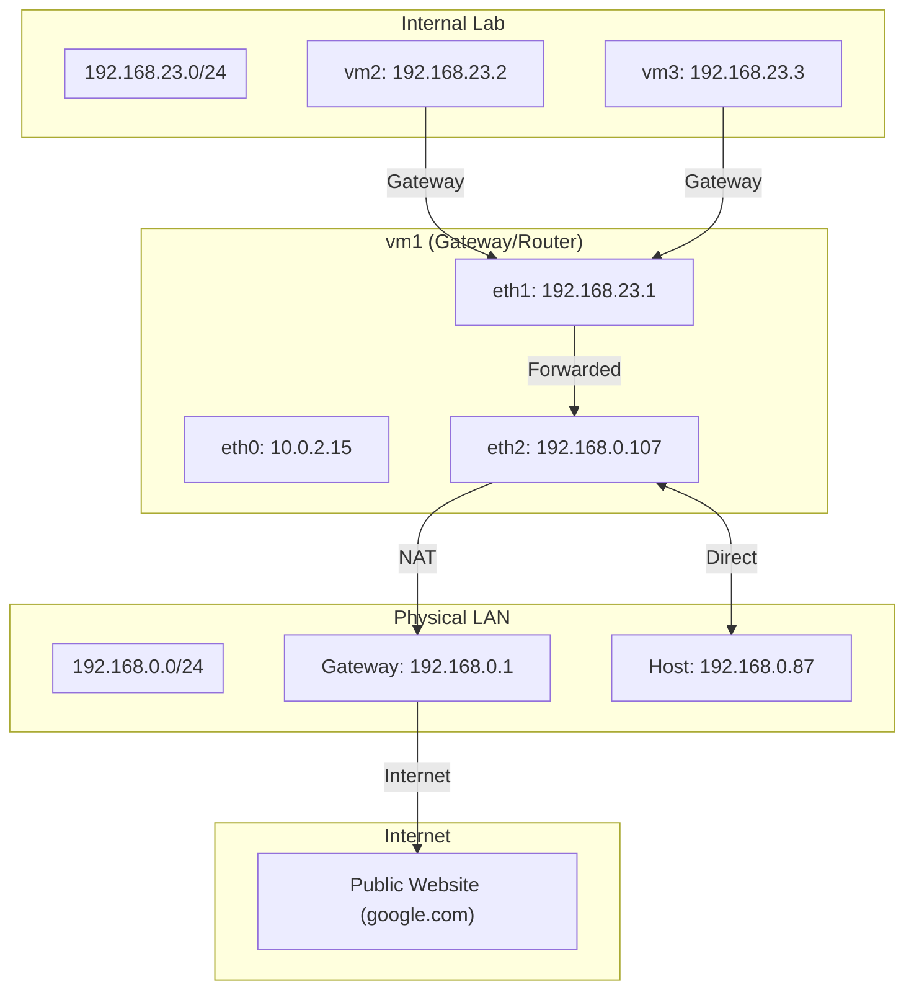

# VirtualBox Network Mode: Internal Network

## Goal

Understand the behavior of an isolated **Internal Network** by building a three-node infrastructure on the **192.168.23.0/24** subnet. In this topology, `vm2` and `vm3` act as isolated **clients**, while `vm1` is configured as the **gateway** to bridge the private segment with the external world.

To achieve connectivity, we manually configure three critical networking functions that are typically automated:

1. **IPv4 Forwarding**: Enabling `vm1` to pass traffic between its internal and external network interfaces, i.e. between the isolated private subnet and the external exit interfaces. It allows `vm1` to act as a router as well.
2. **NAT Masquerade**: Translating the private client addresses into `vm1`'s bridged IP so the physical network can return traffic.
3. **Default Gateway**: Establishing vm1 as the exit point for the client VMs to reach external networks.

## Summary of Internal Network Mode

In Internal Network mode, VirtualBox creates an isolated **broadcast domain** managed by an unmanaged **virtual switch**. The virtual machines in this lab—`vm1`, `vm2`, and `vm3`—are connected to this switch, allowing them to communicate with each other while remaining logically separated from the host machine, the physical LAN, and the internet. Unlike NAT or Bridged modes, the hypervisor does not provide automated networking services like DHCP or a default gateway.

**Key Characteristics:**

- **Broadcast Domain Scope**: A **broadcast domain** is the scope of a **one-to-all** frame. When a VM sends a frame to "everyone," the virtual switch delivers it to every node on the same **segment** (the group of ports connected to that switch). In this lab, when `vm2` sends an ARP request, the virtual switch delivers it to both `vm1` and `vm3`.
- **Layer 2 Isolation**: The hypervisor acts as an unmanaged virtual switch. It behaves like a "dumb" wire that only moves Ethernet frames between MAC addresses, with no configuration interface or built-in services. This ensures that all traffic, such as ARP requests, stays within the virtual segment and never reaches the host or physical network.
- **Layer 3 Connectivity**: Since there is no DHCP server, we use the **192.168.23.0/24** subnet for this lab. This requires assigning static IP addresses to each guest VM to enable communication.
- **Manual Service Configuration**: Since the hypervisor provides no default gateway or NAT services for internal networks, all routing logic—including IPv4 forwarding and masquerading—must be explicitly configured within a guest VM (`vm1`) to enable external access.

## Network Topology (Internal Network)



**Understanding the Topology**

This diagram illustrates the path traffic takes from an isolated internal client to the internet. The infrastructure is defined by three logical segments: the **Internal Lab**, the **Gateway (`vm1`)**, and the **Physical LAN**.

- **Internal Lab (`vm2`, `vm3`)**: These nodes reside on the private `192.168.23.0/24` subnet. Since they are logically isolated from the physical network, their only exit point is the `eth1` interface of `vm1`.
- **The Gateway (`vm1`)**: This node acts as the bridge between the internal and external worlds. It possesses three active network interfaces:
  - `eth0`: Connects to the management network for administration.
  - `eth1`: Acts as the gateway for the internal lab (`192.168.23.1`).
  - `eth2`: Connects to the physical LAN (`192.168.0.107`), serving as the external exit path.
- **Routing Logic and Translation**:
  - **Forwarding**: When a client sends traffic to an external destination, `vm1` performs a routing decision. It moves the packet from the `eth1` interface to the `eth2` interface—this is the **Forwarded** path shown in the diagram.
  - **NAT (Masquerade)**: As the packet leaves `eth2`, `vm1` applies a Source NAT rule. This replaces the client's internal IP (`192.168.23.x`) with the gateway's bridged IP (`192.168.0.107`). This ensures that return traffic from the internet reaches the gateway, where it can then be un-translated and forwarded back to the original internal client.
- **External Exit**: Once the packet leaves `eth2` with the gateway's IP, it is handed to the physical LAN Router (`192.168.0.1`), which directs it toward the internet.

## Key Learning Objectives

- Understand the requirement for a VM with multiple network interfaces to connect isolated network segments.
- Configure and validate kernel-level IPv4 forwarding and NAT masquerading.
- Observe the effect of setting `vm1` as the gateway on the path to the internet.

## Prerequisites

- [VirtualBox](https://www.virtualbox.org/wiki/Downloads)
- [Vagrant](https://developer.hashicorp.com/vagrant/install)

## Prerequisites inside the VM's

- curl: `sudo apt update & sudo apt install curl`

## The Vagrantfile [Configuration](./Vagrantfile)

### Technical Overview

The Vagrantfile automates the deployment of a custom routing infrastructure. Instead of utilizing the hypervisor's built-in NAT, we configure a gateway using `vm1`.

- **The Gateway (vm1)**:
  This VM is configured with three network interfaces to pass traffic between networks:
  1. **NAT (eth0)**: Utilized by Vagrant for SSH management.
  2. **Internal (eth1)**: Connected to the isolated segment (`192.168.23.0/24`).
  3. **Bridged (eth2)**: Connected to the physical LAN to provide an external exit path.

- **The Internal Nodes (vm2, vm3)**:
  These nodes are connected to the internal segment and the management NAT interface. They lack a direct path to the physical LAN or the internet.

- **Provisioning**: The configuration automates the transition from isolation to connectivity:
  1. It enables IPv4 forwarding in the Linux kernel on `vm1`.
  2. It adds a NAT masquerade rule to the `iptables` POSTROUTING chain on `vm1`.
  3. It adds a new default gateway pointing to `vm1`.

---

## Foundational Experiments

Before proceeding, ensure you have completed the [essential experiments in the NAT lab](../NAT/LAB-GUIDE.md#some-basic-experiments). You should be comfortable using `ip route` to see where traffic is sent and `ip addr` to check if your network interfaces are active and have the correct IPs.

---

## Guided Experiments

### 1. Verifying Network Interface Assignments (All VMs)

**Objective**: Verify IP address assignments on all network interfaces to confirm connectivity to the NAT, internal, and external networks.

Run `ip -br a` on **each VM**.

**vm1 (The Gateway)**:

```bash
vagrant@vm1:~$ ip -br a
lo               UNKNOWN        127.0.0.1/8 ::1/128
eth0             UP             10.0.2.15/24 fd17:625c:f037:2:a00:27ff:fe8d:c04d/64 fe80::a00:27ff:fe8d:c04d/64
eth1             UP             192.168.23.1/24 fe80::a00:27ff:fe65:9803/64
eth2             UP             192.168.0.107/24 2804:14d:4c58:806a:a00:27ff:fe19:c6bf/64 fe80::a00:27ff:fe19:c6bf/64
```

**vm2 & vm3 (The Clients)**:

```bash
vagrant@vm2:~$ ip -br a
lo               UNKNOWN        127.0.0.1/8 ::1/128
eth0             UP             10.0.2.15/24 fd17:625c:f037:2:a00:27ff:fe8d:c04d/64 fe80::a00:27ff:fe8d:c04d/64
eth1             UP             192.168.23.2/24 fe80::a00:27ff:fef8:c2e/64
```

**What this tells us**:

- **vm1 (The Gateway)**:
  - `lo`: This is the loopback interface, used for internal system communication.
  - `eth0`: This interface is connected to the NAT network for management purposes and is reachable from your host machine.
  - `eth1`: This is the internal network interface with IP `192.168.23.1`. It connects `vm1` to the lab subnet, allowing it to communicate with the client VMs.
  - `eth2`: This interface connects `vm1` to the physical LAN via a Bridged connection, providing the exit path to external networks.

- **vm2 & vm3 (The Clients)**:
  - `lo`: Loopback interface for local system communication.
  - `eth0`: Management interface connected to the NAT network.
  - `eth1`: Internal network interface with static IP address (`192.168.23.2` for `vm2` and `192.168.23.3` for `vm3`). This is the only path they have to the private lab subnet.

### 2. Inspecting the Routing Tables (All VMs)

**Objective**: Inspect the routing tables to verify how each VM identifies local and external network paths.

Run `ip route` on **each VM**.

**vm1 (The Gateway)**:

```bash
vagrant@vm1:~$ ip route
default via 192.168.0.1 dev eth2
10.0.2.0/24 dev eth0 proto kernel scope link src 10.0.2.15
192.168.0.0/24 dev eth2 proto kernel scope link src 192.168.0.107
192.168.23.0/24 dev eth1 proto kernel scope link src 192.168.23.1
```

**vm2 & vm3 (The Clients)**:

````bash
vagrant@vm2:~$ ip route
default via 192.168.23.1 dev eth1
10.0.2.0/24 dev eth0 proto kernel scope link src 10.0.2.15
192.168.23.0/24 dev eth1 proto kernel scope link src 192.168.23.2

**What this tells us**:

- **On vm1 (The Gateway)**:
  - _Line 1_: "Anything I don't know where to send ('default'), send it to `192.168.0.1` (the physical LAN gateway) via `eth2`. This is the exit path to the internet."
  - _Line 2_: "To talk to anything in the `10.0.2.0/24` management network, just send it straight out `eth0` because that is a directly connected network."
  - _Line 3_: "To talk to anything in the `192.168.0.0/24` physical LAN, just send it straight out `eth2` because that is a directly connected network."
  - _Line 4_: "To talk to the lab's private `192.168.23.0/24` network, send it straight out `eth1`. That's where `vm2` and `vm3` are."

- **On the Clients (vm2 & vm3)**:
  - _Line 1_: "Anything I don't know where to send ('default'), send it to `192.168.23.1` (`vm1`) via `eth1`. This forces all internet-bound traffic through `vm1`."
  - _Line 2_: "To talk to the management network (`10.0.2.0/24`), send packets straight out `eth0`—no gateway needed (Direct Link)."
  - _Line 3_: "To talk to other lab VMs in the `192.168.23.0/24` network, send packets straight out `eth1`—no gateway needed (Direct Link)."

### 2. Internal Connectivity: Direct vs. Routed Path

**Objective**: Determine if communication between `vm2` and `vm3` goes through the gateway (`vm1`) or directly over the internal wire.

From `vm2`, ping `vm3` and then inspect the neighbor table:

```bash
ping -c 3 192.168.23.3
ip -4  neighbor show

vagrant@vm2:~$ ping -c3 192.168.23.3
PING 192.168.23.3 (192.168.23.3) 56(84) bytes of data.
64 bytes from 192.168.23.3: icmp_seq=1 ttl=64 time=0.381 ms
64 bytes from 192.168.23.3: icmp_seq=2 ttl=64 time=0.281 ms
64 bytes from 192.168.23.3: icmp_seq=3 ttl=64 time=0.346 ms

--- 192.168.23.3 ping statistics ---
3 packets transmitted, 3 received, 0% packet loss, time 1998ms
rtt min/avg/max/mdev = 0.281/0.336/0.381/0.041 ms
vagrant@vm2:~$ ip -4 neighbor show
192.168.23.3 dev eth1 lladdr 08:00:27:ca:f6:0c REACHABLE
10.0.2.2 dev eth0 lladdr 52:55:0a:00:02:02 REACHABLE
192.168.23.1 dev eth1 lladdr 08:00:27:65:98:03 STALE
````

**Interpretation**:

1. **Direct Communication (Layer 2)**: When `vm2` pings `vm3` (192.168.23.3), it checks its routing table. Because the destination is in the same subnet, the OS sees it as `scope link` (reachable on the local segment). It then broadcasts an ARP request: _"Who has 192.168.23.3? Tell 192.168.23.2"_.
2. **The Evidence**: The fact that `ip neighbor` shows `192.168.23.3` associated with a specific MAC address (`08:00:27...`) means `vm2` and `vm3` successfully completed that handshake directly.

**Conclusion**: Seeing `vm3`'s IP and MAC in the table confirms they are communicating directly on the shared virtual segment without `vm1` intermediate intervention.

**Complementary Test: Pinging the Host**
If you ping your host machine (e.g., `ping -c 3 192.168.0.x`) and run `ip neighbor` again, the table will **not** change.

- **Why?**: Since the host is on a different network, `vm2` knows it cannot talk to it directly. Instead of asking "Who has 192.168.0.x?" (ARP), it simply hands the packet to the gateway it already knows: **192.168.23.1**.
- **The Evidence**: `vm2` never needs the MAC address of the host, so it never performs an ARP request for that IP. It reuses the MAC address of `vm1` (the gateway) to encapsulate the packet for delivery.

### 3. Verifying the Router Service Configuration on vm1

**Objective**: Verify the configuration on `vm1` that enables it to route traffic from the internal clients to the external network and hide their private IP addresses.

Run `sudo sysctl net.ipv4.ip_forward` and `sudo iptables -t nat -L POSTROUTING` on `vm1`.

```bash
vagrant@vm1:~$ sudo sysctl net.ipv4.ip_forward
net.ipv4.ip_forward = 1

vagrant@vm1:~$ sudo iptables -t nat -L POSTROUTING
Chain POSTROUTING (policy ACCEPT)
target     prot opt source               destination
MASQUERADE  all  --  anywhere             anywhere
```

**Output Breakdown:**

- **IPv4 Forwarding**: Setting `net.ipv4.ip_forward` to `1` enables the kernel to route packets between different interfaces. Without this, `vm1` would block any traffic attempting to cross from the internal subnet to the external network.
- **`Chain POSTROUTING`**: This is the final stage of the iptables process, applied to packets that have passed the routing decision and are about to exit the gateway via any interface defined in our routing table.
- **`target (MASQUERADE)`**: This rule defines the source address translation logic for all egress traffic: _"Take the source IP of any packet exiting an interface and replace it with the current IP address of that interface."_ Since no specific output interface was specified, the rule applies to every egress path defined in the routing table:
  - **For the `default` route via `eth2` (`192.168.0.1`)**: This rule is critical. It replaces the internal client's private IP (`192.168.23.x`) with the gateway's bridged IP (`192.168.0.107`). This ensures that the external network sees the packet as originating from `vm1`, allowing return traffic from the internet to be correctly routed back to the gateway.
  - **For the `10.0.2.0/24` management network (`eth0`)**: The rule is applied, but it is redundant because the hypervisor already performs its own address translation for this management interface.
  - **For the `192.168.23.0/24` lab subnet (`eth1`)**: The rule is applied, but it has no effect because the packet's source IP (`192.168.23.1`) is already the same as the interface it is walking out of.
- **`prot (all)`**: Indicates that the rule applies to all protocols (TCP, UDP, ICMP, etc.).
- **`source (anywhere)`**: Matches packets from any source IP address, including those originating from the local loopback (`127.0.0.1`), the management network (`10.0.2.0/24`), and the internal lab subnet (`192.168.23.0/24`).
- **`destination (anywhere)`**: Matches packets destined for any external address (the internet or your physical LAN).

The MASQUERADE target achieves this through dynamic source network address translation (SNAT). Here is how it functions when a packet from a client (192.168.23.2) passes through vm1:

1.  Ingress: A packet from vm2 (192.168.23.2) arrives at vm1's eth1 interface, destined for an internet IP (e.g., 8.8.8.8).
2.  Routing Decision: vm1 determines the packet needs to exit via its default gateway, which points to the eth2 (Bridged) interface.
3.  POSTROUTING Hook: Before the packet is physically transmitted on eth2, the kernel's iptables rules are consulted. The MASQUERADE rule in the POSTROUTING chain is triggered.
4.  Translation (The "Magic"):
    - The kernel identifies the outgoing interface as eth2 and retrieves its current IP address (192.168.0.107).
    - It overwrites the packet's Source IP (192.168.23.2) with the IP of the eth2 interface (192.168.0.107).
    - It modifies the packet's source port if necessary to ensure uniqueness, keeping track of this mapping in the connection tracking (conntrack) table.
5.  Egress: The packet exits vm1 with a source IP of 192.168.0.107. The physical network sees traffic originating from vm1.
6.  Return Path: When the response arrives back at vm1 from the internet, the kernel checks the conntrack table, restores the original destination IP (192.168.23.2), and forwards the packet back to the internal client.

In summary: MASQUERADE is a specialized form of SNAT that automatically uses the primary IP address of the outgoing interface. By pointing the egress traffic to eth2, the Masquerade rule forces all internal traffic to wear vm1's bridged IP as its return address, making it fully routable on the physical LAN.

### 4. Path Validation (Traceroute)

**Objective**: Use `traceroute` to verify the multi-hop path when accessing external networks.

From `vm2`, run `traceroute -n 8.8.8.8`.

```bash
vagrant@vm2:~$ traceroute 8.8.8.8
traceroute to 8.8.8.8 (8.8.8.8), 30 hops max, 60 byte packets
 1  192.168.23.1 (192.168.23.1)  0.652 ms  0.590 ms  0.528 ms
 2  192.168.0.1 (192.168.0.1)  16.678 ms  16.816 ms  16.870 ms
 3  bd069001.virtua.com.br (189.6.144.1)  18.409 ms  18.647 ms  18.908 ms
 4  c915e43d.virtua.com.br (201.21.228.61)  19.950 ms  20.384 ms  20.495 ms
 5  embratel-H0-5-0-0-agg02.paenr.embratel.net.br (200.191.198.5)  20.028 ms
 ...
```

**What this means**:
The traceroute reveals the step-by-step path from the internal node to the internet:

1.  **Hop 1 (192.168.23.1)**: The packet arrives at `vm1` (our gateway).
2.  **Hop 2 (192.168.0.1)**: This is your physical WiFi router. It means the packet has finally left the VirtualBox environment and is on your physical LAN.
3.  **Hop 3+**: These are the public IPs of your ISP and the internet backbone.

**Conclusion**: This confirms the packet path: `vm2` -> `vm1` -> `Physical Router` -> `Internet`.

### 5. Name Resolution and DNS

**Objective**: Determine how internal nodes resolve external domain names and validate the network path these queries take.

**Context**:
When a VM boots, it inherits DNS configuration from the host via DHCP. Check your resolver settings on `vm2`:

```bash
vagrant@vm2:~$ cat /etc/resolv.conf
nameserver 181.213.132.8
nameserver 181.213.132.9
nameserver 244.213.132.9
```

**Evidence**:

### 5. Name Resolution and DNS

**Objective**: Determine how internal nodes resolve external domain names and validate the network path these queries traverse.

**Context**:
VMs inherit DNS resolvers from the host via DHCP. Check your resolver configuration on `vm2`:

```bash
vagrant@vm2:~$ cat /etc/resolv.conf
nameserver 181.213.132.8
nameserver 181.213.132.9
nameserver 244.213.132.9
```

**Functional Verification**:
First, confirm that the node can resolve and connect to an external destination:

```bash
vagrant@vm2:~$ host google.com
google.com has address 172.217.162.174
...
vagrant@vm2:~$ ping -c 3 google.com
PING google.com (172.217.162.174) 56(84) bytes of data.
64 bytes from ... icmp_seq=1 ttl=112 time=133 ms
...
```

**Diagnostic Evidence**:
To understand _how_ this resolution succeeds, trace the path to your configured DNS server (`181.213.132.8`):

```bash
vagrant@vm2:~$ traceroute 181.213.132.8
traceroute to 181.213.132.8 (181.213.132.8), 30 hops max, 60 byte packets
 1  192.168.23.1 (192.168.23.1)  0.373 ms  0.304 ms  0.252 ms
 2  192.168.0.1 (192.168.0.1)  1.476 ms  2.417 ms  2.911 ms
 3  bd069001.virtua.com.br (189.6.144.1)  5.566 ms  5.502 ms  5.725 ms
 4  c915e43d.virtua.com.br (201.21.228.61)  8.199 ms  8.166 ms  8.120 ms
 5  embratel-H0-5-0-1-4004-agg02.paenr.embratel.net.br (200.191.198.1)  8.072 ms  8.039 ms  8.005 ms
```

**Analysis**:
The results above demonstrate that DNS resolution is an active network operation dependent on our routing configuration:

1.  **Resolution Dependency**: The `host` command demonstrates that `vm2` can perform lookups. However, these lookups are not local; they are remote queries to the `nameserver` IPs.
2.  **Path Dependency**: The `traceroute 181.213.132.8` provides empirical proof that these DNS queries (UDP/53) are routed through our gateway (`vm1`) to reach the resolver.
3.  **Conclusion**: Successful hostname resolution (`host google.com`) and data transmission (`ping`) are both dependent on `vm1` acting as a router. If the route to the DNS resolver—or the route to the resolved IP—is disrupted at `vm1`, the entire internet-facing communication chain breaks.

**Note on Routing Dependencies**: The traceroute results demonstrate that DNS queries are not handled by the management interface (eth0); instead, they follow the default route through our gateway (vm1). Because all traffic destined for external IP addresses—including those of your DNS resolvers—is routed through vm1, the gateway is as critical for name resolution as
it is for data transmission. If the route through vm1 is unavailable, hostname resolution will fail, rendering the system unable to reach external services.

### 6. Service Visibility and Access Boundaries

**Objective**: Determine how network isolation and gateway positioning affect service reachability.

#### Part A: Internal Node Visibility (vm2)

1. **Start a server on vm2**: `vagrant ssh vm2` and run `python3 -m http.server 8080`.
2. **Test from vm3 (Peer)**: `curl -I 192.168.23.2:8080`.
3. **Test from vm1 (Gateway)**: `curl -I 192.168.23.2:8080`.
4. **Test from Host**: `curl -I 192.168.23.2:8080`

#### Part B: Gateway Visibility (vm1)

1. **Start a server on vm1**: `vagrant ssh vm1` and run `python3 -m http.server 8080`.
2. **Test from vm2 (Internal)**: `curl -I 192.168.23.1:8080`.
3. **Test from Host**: `curl -I <vm1-bridged-ip>:8080`.

**[INSERT OBSERVATIONS HERE]**

**What this means (Part A: vm2 server)**:

- **From vm3 (Peer)**: Success. Both are on the same virtual segment (`intnet-lab`). Traffic travels directly via the virtual switch.
- **From vm1 (Gateway)**: Success. `vm1` is physically connected to the same internal segment on its `eth1` interface.
- **From the Host**: **Failure**. This is the key lesson. Even though `vm1` is routing traffic _out_ from `vm2`, it is not forwarding traffic _in_. This is due to the inherent isolation of the Internal Network and the lack of a destination NAT rule on `vm1` to handle unsolicited inbound traffic.

**What this means (Part B: vm1 server)**:

- **From vm2 (Internal)**: Success. `vm2` reaches the gateway via the internal IP (`192.168.23.1`) on the shared segment.
- **From the Host**: **Success**. `vm1` has its `eth2` interface connected to your physical network. This makes it directly reachable from your host machine, just like any other device on your local network.

**Conclusion**: The Internal Network is isolated from your host. While `vm1` can reach the internal nodes, your host cannot see them directly, even though it provides their path to the internet.

---

## Key Takeaways

### 1. Gateway as a Software State

We proved that a "gateway" isn't a special device, but a configuration. By enabling `net.ipv4.ip_forward` and adding an `iptables` masquerade rule, we transformed a standard VM into a router. Without these manual steps, `vm1` would have simply dropped the traffic from its peers.

### 2. Manual Path Control

By manipulating the `ip route` table on the client nodes, we forced the operating system to ignore its built-in NAT exit in favor of our custom gateway. The `traceroute` results confirmed this change, showing our internal IP (`192.168.23.1`) as the very first hop.

### 3. Layer 2 Isolation and Topology Hiding

The "Internal Network" is logically isolated from the host at Layer 2. The NAT Masquerade rule on `vm1` completes this isolation at Layer 3 by masking internal IP addresses behind a single external identity. This prevents internal topology leakage and ensures that the host can only communicate with the internal nodes if they initiate the connection first.

### 4. Layer 2 vs. Layer 3: The Neighbor Table Evidence

The `ip neighbor` check provided empirical proof of how the OS chooses its path. For local traffic (`vm2` to `vm3`), the table contains the peer's MAC address because they talk directly (Layer 2). For external traffic, the table only needs the gateway's MAC address, because the OS knows it must hand the packet to `vm1` (Layer 3) to reach any destination beyond the local wire.
