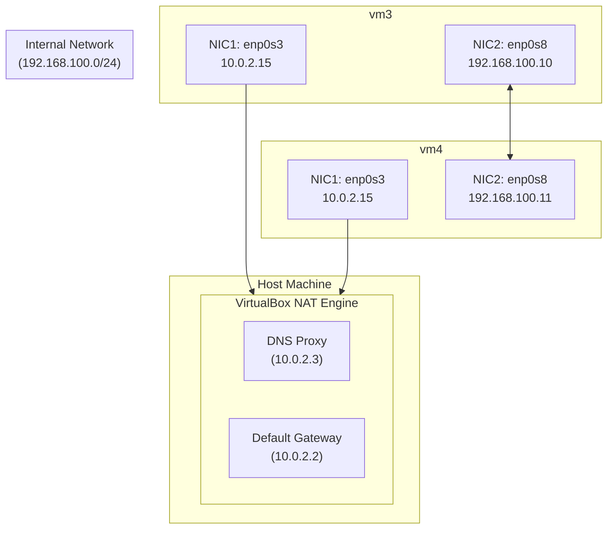
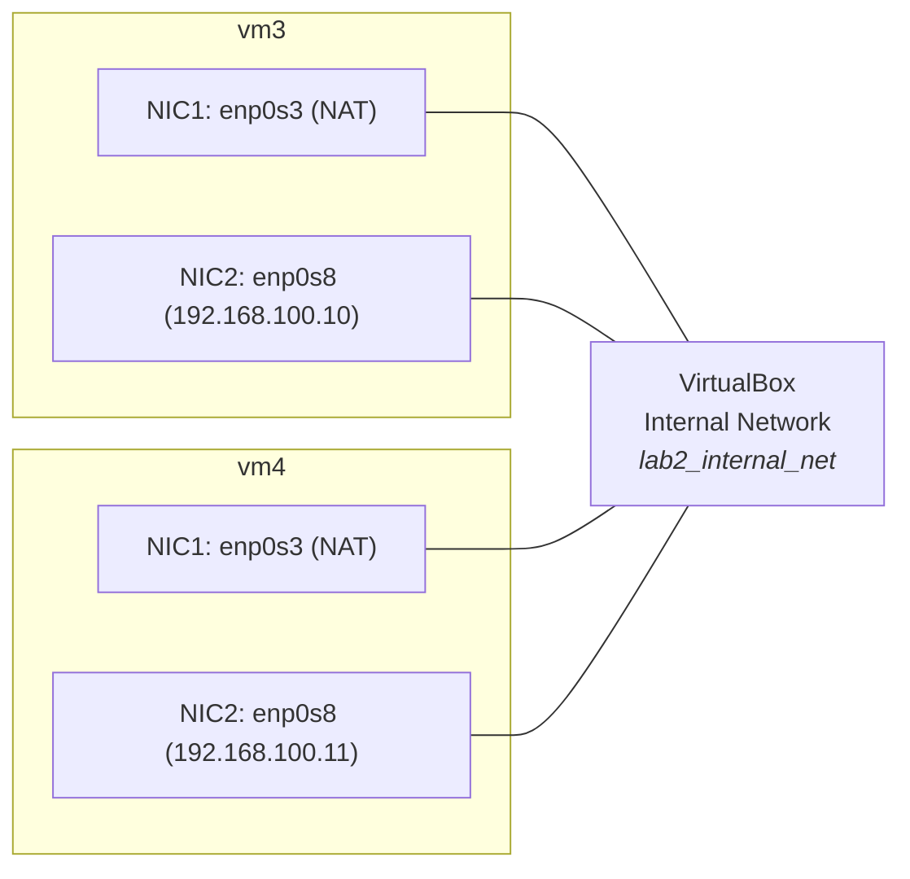

# VirtualBox Network Mode: Internal Network

<!-- TOC -->
- [VirtualBox Network Mode: Internal Network](#virtualbox-network-mode-internal-network)
  - [Goal](#goal)
  - [Key Learning Objectives](#key-learning-objectives)
  - [Summary of Internal Network Mode](#summary-of-internal-network-mode)
  - [Network Topology (VirtualBox Internal Mode)](#network-topology-virtualbox-internal-mode)
  - [The Vagrantfile Configuration](#the-vagrantfile-configuration)
    - [Informal Explanation](#informal-explanation)
    - [Networking Assumptions](#networking-assumptions)
  - [Setup](#setup)
  - [Prerequisites](#prerequisites)
  - [Prerequisites inside the VM's](#prerequisites-inside-the-vms)
  - [Getting Started](#getting-started)
  - [Some Basic Experiments](#some-basic-experiments)
  - [Key Takeaways](#key-takeaways)
  - [Summary of Useful Commands](#summary-of-useful-commands)
    - [Vagrant and Virtual Box Commands:](#vagrant-and-virtual-box-commands)
    - [Linux Networking Commands (Inside VM)](#linux-networking-commands-inside-vm)

<!-- /TOC -->


## Goal

To understand and experiment with the Internal Network mode in VirtualBox, which creates a private network completely isolated from the host and the outside world. Only VMs connected to the same Internal Network name can communicate. This Lab was inspired by the excelent [article/post](https://www.nakivo.com/blog/virtualbox-network-setting-guide/) on VirtualBox Network Settings by the Nakivo Team.

## Key Learning Objectives

- Learn what Internal Network mode is.
- [Configure with Vagrant](./Vagrantfile) two or more VMs to communicate only within an isolated VirtualBox network.
- Understand and validate:
    - Interface IP addressing
    - Basic ping/ssh between VMs
    - Isolation from host and internet

## Summary of Internal Network Mode

Virtual machines whose adapters are configured to work in the VirtualBox Internal Network mode are connected to an isolated virtual network. VMs connected to this network can communicate with each other, but they cannot communicate with a VirtualBox host machine, or with any other hosts in a physical network or in external networks. VMs connected to the internal network cannot be accessed from a host or any other devices. The VirtualBox internal network can be used for modelling real networks.

## Network Topology (VirtualBox Internal Mode)



## The Vagrantfile [Configuration](./Vagrantfile)

### Informal Explanation 

The `Vagrantfile` defines two virtual machines, `vm3` and `vm4`, both based on the Ubuntu 22.04 (Jammy) image. Each VM is connected to an **internal network** called `lab2_internal_net`, using **VirtualBox’s Internal Network mode**. This ensures that both VMs can talk to each other, but **not to the host or the internet** — which is exactly the point of this lab.

Here's how it works, step by step:

- Both VMs use the same base box: `ubuntu/jammy64`, which is a lightweight official Ubuntu image.
- Each VM is assigned a hostname (`vm3` and `vm4`) to make them easier to identify.
- The critical line is the `vm.network "private_network", virtualbox__intnet: ...` declaration:
  - This tells VirtualBox to use the *internal network mode* (not bridged, not NAT) and to place both VMs inside a shared internal network.
  - We give this internal network a custom name (`lab2_internal_net`) so it’s easier to track and reuse.
  - Each VM gets a static IP address within the same subnet (`192.168.100.x/24`) so they can reach each other easily.

In addition:

- We customize the name each VM appears with inside VirtualBox (e.g., `lab2_vm3`) — helpful when checking the VirtualBox GUI.
- Each VM gets modest resources: 512 MB of RAM and 1 CPU — enough for basic networking tests without consuming your system.

> 🛠 Note: Initially, each VM also gets a NAT adapter (`enp0s3`) by default so that Vagrant can boot the machine and SSH into it. After boot, we manually remove the default route and IPv6 route tied to that adapter to fully isolate the VMs, as expected in an Internal Network scenario.



### Networking Assumptions

Vagrant assumes there is an available NAT device on `eth0`. This ensures that Vagrant always has a way of communicating with the guest machine. It is possible to change this manually (outside of Vagrant), however, this may lead to inconsistent behavior. Providers might have additional assumptions. For example, in VirtualBox, this assumption means that network adapter 1 is a NAT device.

## Setup
Two Ubuntu VMs provisioned with Vagrant and running on VirtualBox.

## Prerequisites 
- [VirtualBox](https://www.virtualbox.org/wiki/Downloads)
- [Vagrant](https://developer.hashicorp.com/vagrant/install)

## Prerequisites inside the VM's
- Network Manager: `sudo apt install network-manager`
- jq: `sudo apt install jq`

## Getting Started
1. Start both VMs: `vagrant up`
2. Open a terminal and connect to the first VM: `vagrant ssh vm3`
3. Open a terminal and connect to the second VM (if necessary): `vagrant ssh vm4`
4. To stop a VM: run `exit` and then `vagrant halt`

## Some Basic Experiments
- `ip -4 address`
   ```bash
  1: lo: <LOOPBACK,UP,LOWER_UP> mtu 65536 qdisc noqueue state UNKNOWN group default qlen 1000
    inet 127.0.0.1/8 scope host lo
       valid_lft forever preferred_lft forever
  2: enp0s3: <BROADCAST,MULTICAST,UP,LOWER_UP> mtu 1500 qdisc fq_codel state UP group default qlen 1000
    inet 10.0.2.15/24 metric 100 brd 10.0.2.255 scope global dynamic enp0s3
       valid_lft 86335sec preferred_lft 86335sec
  3: enp0s8: <BROADCAST,MULTICAST,UP,LOWER_UP> mtu 1500 qdisc fq_codel state UP group default qlen 1000
    inet 192.168.100.10/24 brd 192.168.100.255 scope global enp0s8
       valid_lft forever preferred_lft forever
   ```

When you run ip -4 address, you're asking Linux to list all the IPv4 addresses currently assigned to the system's network interfaces. The output shows three interfaces.

The first one is called `lo`, which stands for loopback. This is a special virtual interface that allows the machine to talk to itself internally. It has the IP address `127.0.0.1`, commonly known as "localhost", and it's always available, with no expiration. The system uses this for internal communications, like when you test a web server running on your own machine.

The interface `enp0s3` is a software abstraction created by the operating system to provide Layer 3 (IP) access through the VM’s first virtual NIC (Adapter 1). This NIC is automatically attached by VirtualBox and Vagrant and is connected to a virtual NAT router on the host, which provides outbound internet access during the VM's boot and provisioning. For example, to establish the SSH connection or run provisioning commands. It receives an IP address (like 10.0.2.15) from a built-in DHCP server embedded in the VirtualBox NAT system, which runs entirely on the host. This DHCP service and its gateway (typically `10.0.2.2`) are simulated components — they are not part of the guest operating system. The resulting IP (10.0.2.15) is part of the 10.0.2.0/24 subnet and gives the VM access to the outside world via a NAT rule managed by VirtualBox.

However, in this lab we aim to test internal-only communication, so allowing any internet access would violate that isolation. Initially, we leave enp0s3 in place to let Vagrant do its job. After the VM has booted and provisioning is complete, we manually disable external connectivity by removing both the IPv4 and IPv6 default routes associated with enp0s3.

This is confirmed by inspecting the routing tables:

```bash
$ ip route
default via 10.0.2.2 dev enp0s3 proto dhcp src 10.0.2.15 metric 100 
10.0.2.0/24 dev enp0s3 proto kernel scope link src 10.0.2.15 metric 100 
10.0.2.2 dev enp0s3 proto dhcp scope link src 10.0.2.15 metric 100 
10.0.2.3 dev enp0s3 proto dhcp scope link src 10.0.2.15 metric 100 
192.168.100.0/24 dev enp0s8 proto kernel scope link src 192.168.100.11

$ ip -6 route
::1 dev lo proto kernel metric 256 pref medium
fd00::/64 dev enp0s3 proto ra metric 100 expires 86320sec pref medium
fe80::/64 dev enp0s3 proto kernel metric 256 pref medium
fe80::/64 dev enp0s8 proto kernel metric 256 pref medium
default via fe80::2 dev enp0s3 proto ra metric 100 expires 1720sec pref medium
```

To enforce full isolation from the outside world — across both protocols — we explicitly remove these two default routes:

```bash
sudo ip route del default via 10.0.2.2 dev enp0s3
sudo ip -6 route del default via fe80::2 dev enp0s3
```
After doing so, the VM remains accessible through the internal interface enp0s8, but any attempt to reach the internet (e.g., using `ping 8.8.8.8` or `ping www.google.com`) fails. This ensures that all traffic is confined within the internal network, as expected for this lab.

The third interface, `enp0s8`, is the one that actually matters for this lab. It’s tied to VirtualBox’s Internal Network mode, which we configured manually in the Vagrantfile as _Adapter 2_. This network type provides a completely isolated environment: VMs connected to the same internal network can talk to each other, but have no access to the host or the internet. We assigned a static IP address (`192.168.100.10` on `vm3`, for example), and this is the address used for communication between VMs in this lab. No DHCP or NAT is involved — this is a controlled, isolated virtual LAN.

- `ping 8.8.8.8` (fails,`ping: connect: Network is unreachable` )
- `sudo apt update` (success, i.e, the external internet is reachable)
- `ping 192.168.100.11` (success if inside `vm3`, `failure`otherwise)
- `ping 192.168.100.10` (success if inside `vm4`, `failure`otherwise)
- `ip route` (this will return an output similar to the following, assuming the default route was deleted, as explained above)

```bash
10.0.2.0/24 dev enp0s3 proto kernel scope link src 10.0.2.15 metric 100 
10.0.2.2 dev enp0s3 proto dhcp scope link src 10.0.2.15 metric 100 
10.0.2.3 dev enp0s3 proto dhcp scope link src 10.0.2.15 metric 100 
192.168.100.0/24 dev enp0s8 proto kernel scope link src 192.168.100.10 
```

The command above displays the kernel routing table from `vm3` - the rules the system uses to decide where to send packets. The output will be identical if the command in `vm2` as well. The basic syntax structure of a route rule (simplified) is the following:

```bash
[<destination>] [via <gateway>] dev <interface> [proto <protocol>] [scope <scope>] [src <source IP>] [metric <metric>]
```

Some comments:

- _Line 1_: "If there is a need to talk to any device in the local network `10.0.2.x`, send it directly out via interface `enp0s3` (no gateway needed). Use IP `10.0.2.15` when sending packets out this route".
- _Line 2_:"Here is a specific route to `10.0.2.2` (the NAT router/gateway), reachable directly via enp0s3. Packets to this IP use source IP `10.0.2.15` on interface enp0s3. However, because the default route was deleted, your VM can reach the NAT router itself but cannot route packets beyond it to the internet."
- _Line 3_: "Here is a specific route to `10.0.2.2` (the NAT router/gateway), reachable directly via enp0s3. Packets to this IP use source IP `10.0.2.15` on interface enp0s3. However, because the default route was deleted, your VM can reach the NAT router itself but cannot route packets beyond it to the internet."
- _Line 4_: "If there is a need to talk to any device in the local network `192.168.100.x`, send it directly out via interface `enp0s8` (no gateway needed). Use IPs `192.168.100.10` or `192.168.100.11` when sending packets out this route".

The routes labeled `proto dchp` were added dynamically  by the DHCP client when the VM booted and got its IP/gateway/DNS information. The routes labeled `proto kernel` were added dynamically by the DHCP

if you run `ip -j route show | jq`  you can the above table in JSON (You will have to run `sudo apt install jq`).

```bash
[
  ...,
  {
    "dst": "10.0.2.2",
    "dev": "enp0s3",
    "protocol": "dhcp",
    "scope": "link",
    "prefsrc": "10.0.2.15",
    "metric": 100,
    "flags": []
  },
  {
    "dst": "10.0.2.3",
    "dev": "enp0s3",
    "protocol": "dhcp",
    "scope": "link",
    "prefsrc": "10.0.2.15",
    "metric": 100,
    "flags": []
  },
  {
    "dst": "192.168.100.0/24",
    "dev": "enp0s8",
    "protocol": "kernel",
    "scope": "link",
    "prefsrc": "192.168.100.10",
    "flags": []
  }
]
```

You can get the IP addresses of the VM and its DNS server using  `networkctl status`:

```bash
 ●        State: routable                          
   Online state: online                            
        Address: 10.0.2.15 on enp0s3
                  192.168.100.10 on enp0s8
                  fd00::41:72ff:fefd:616c on enp0s3
                  fe80::41:72ff:fefd:616c on enp0s3
                  fe80::a00:27ff:fe2d:e97a on enp0s8
            DNS: 10.0.2.3
```
 

To see a table of all interfaces, corresponding IP and MAC addresses, go to the root folder of this project
and run the following command to copy the shell script into the home folder of `vm3`
```bash
scp -P <port-number -i C:/Users/alfio/Code/Vagrant/virtual-box-network-modes/Internal/.vagrant/machines/vm3/virtualbox/private_key Scripts/table-ips-macs.sh vagrant@127.0.0.1:/home/vagrant/table-ips-macs.sh
``` 

Note that to get the correct port-number, you have to run `vagrant ssh-config vm1` first.

Then, from the `home/vagrant`folder run:

```bash
chmod +x ./table-ips-macs.sh
./table-ips-macs.sh
```
You should get an output similar to the following:

```bash
=== Interface Information with Neighbors ===

Interface: enp0s3
  - Your IP:  10.0.2.15/24
  - Your MAC: 02:41:72:fd:61:6c
  - Neighbors:
      • 10.0.2.2        → 52:55:0a:00:02:02 (REACHABLE)
      • 10.0.2.3        → 52:55:0a:00:02:03 (STALE)

Interface: enp0s8
  - Your IP:  192.168.100.10/24
  - Your MAC: 08:00:27:2d:e9:7a
  - Neighbors: none

Interface: lo
  - Your IP:  127.0.0.1/8
  - Your MAC: 00:00:00:00:00:00
  - Neighbors: (loopback — no neighbors)
```

To see only the _ARP/Neighbor table - the mapping between _IP addresses_ and _MAC addresses_ on the same local network, run `ip -4 neigh show`:


```bash
10.0.2.2 dev enp0s3 lladdr 52:55:0a:00:02:02 REACHABLE
10.0.2.3 dev enp0s3 lladdr 52:55:0a:00:02:03 STALE
```

In the output above, `lladdr`stands for `link layer (layer 2) address. The state `STALE` says, informally : "We know the MAC address of `10.0.2.3`, but we haven't talked to it recently. If we need to use it again, we'll test if it's still alive."

Indeed, one you run, for instance, we run `ping -c 3 google` and right after `ip -4 neigh show` again, we get:

```bash
10.0.2.2 dev enp0s3 lladdr 52:55:0a:00:02:02 REACHABLE
10.0.2.3 dev enp0s3 lladdr 52:55:0a:00:02:03 REACHABLE
```

To finalize, the command `nmcli device show` (`sudo apt install network-manager`) gives a complete snapshot of every detected network interface, showing device name, MAC address, MTU, IP addresses, routes, gateway, DNS servers, etc.

```bash
...
GENERAL.DEVICE:                         enp0s8
GENERAL.TYPE:                           ethernet
GENERAL.HWADDR:                         08:00:27:2D:E9:7A
GENERAL.MTU:                            1500
GENERAL.STATE:                          10 (unmanaged)
GENERAL.CONNECTION:                     --
GENERAL.CON-PATH:                       --
WIRED-PROPERTIES.CARRIER:               on
IP4.ADDRESS[1]:                         192.168.100.10/24
IP4.GATEWAY:                            --
IP4.ROUTE[1]:                           dst = 192.168.100.0/24, nh = 0.0.0.0, mt = 0
IP6.ADDRESS[1]:                         fe80::a00:27ff:fe2d:e97a/64
IP6.GATEWAY:                            --
IP6.ROUTE[1]:                           dst = fe80::/64, nh = ::, mt = 256
...
```

In the output above, `nh` means next hop, and hence `nh=0.0.0.0` means no next hop -- all hosts in `10.0.2.x` are directly connected.

## Key Takeaways

| Concept                   | Explanation |
|---------------------------|-------------|
| **Internal Network (intnet)** | A VirtualBox mode where VMs can communicate **only with each other** over a private network. No host or internet access unless explicitly routed. |
| **Multiple NICs per VM** | Each VM had: <br>• `NIC1`: connected to NAT (for `vagrant ssh` access).<br>• `NIC2`: connected to the Internal Network (`192.168.100.0/24`). |
| **Static vs. Dynamic IPs** | In this lab, we started with static IPs (`192.168.100.10`, `.11`). Later we explored **DHCP alternatives** and discussed consistency with NAT labs. |
| **Interfaces and Identities** | Each interface (`enp0s3`, `enp0s8`, `lo`) gives the VM a unique network "persona". Routing and neighbor discovery happen per-interface. |
| **Routing Logic** | Without a default route, VMs can't reach the internet. They can only talk to directly connected subnets (e.g., `192.168.100.x`). |
| **Default Gateway Importance** | Removing/re-adding the default route helped us explore isolation vs. internet reachability. It also showed how DHCP dynamically repopulates routes (in IPv6, faster). |
| **Neighbor Table (ARP)** | `ip neigh show` reveals discovered peers via ARP (IPv4). Only shows devices the VM has recently interacted with — not a full "network map". |
| **Shared Folders & SSH Access** | Vagrant shares the project folder into `/vagrant` inside each VM. We used `scp` with the correct SSH key and port (`2222`) to transfer scripts when shared folders were out of scope. |
| **Realism & Troubleshooting** | Internal mode simulates realistic isolated LANs (like data center or Proxmox virtual clusters). It’s useful for testing DNS/DHCP/NAT manually. The lab taught key tools (`ip`, `scp`, `systemd`, etc.) and debugging strategies. |
| **Category Theory Vibe** | Each interface is a morphism connecting the VM to a context (network). Routing tables define the **composable paths**. Your diagrams are literally functorial views of network state. 🚀 |


## Summary of Useful Commands

### Vagrant and Virtual Box Commands:

| Command                                                                 | Description                                                       |
|-------------------------------------------------------------------------|-------------------------------------------------------------------|
| `vagrant up`                                                            | Starts and provisions all machines defined in the Vagrantfile.   |
| `vagrant halt`                                                          | Shuts down the running VM.                                       |
| `vagrant destroy <vmid>`                                               | Destroys the specified VM completely.                            |
| `vagrant global-status --prune`                                        | Lists all known Vagrant environments and removes stale ones.      |
| `vagrant ssh <vm>`                                                     | SSH into the given VM.                                           |
| `vagrant ssh-config <vm>`                                              | Shows SSH config (ports, private keys, hostname) for a VM.       |
| `VBoxManage list natnetworks`                                          | Lists all existing VirtualBox NAT Networks.                      |
| `VBoxManage natnetwork add --netname <name> --network <cidr> --enable --dhcp on` | Creates a new NAT Network with DHCP.                   |
| `VBoxManage natnetwork remove --netname <name>`                        | Deletes an existing NAT network.                                 |

### Linux Networking Commands (Inside VM)

| Command                                     | Description                                                                 |
|--------------------------------------------|-----------------------------------------------------------------------------|
| `ip -4 address`                             | Show IPv4 addresses assigned to each network interface.                    |
| `ip route`                                  | Show IPv4 routing table.                                                   |
| `ip -j route show \| jq`                    | Show the route table in JSON format (with `jq`).                           |
| `ip -4 neigh show`                          | Show the ARP/neighbor table: IP-to-MAC mappings.                           |
| `ping 8.8.8.8`                              | Test external network (Google DNS).                                        |
| `ping vm1` / `ping vm2`                     | Try to reach other VMs by name (requires DNS or host setup).               |
| `sudo journalctl -u systemd-networkd`       | View DHCP/gateway assignment logs (requires systemd-networkd).             |
| `sudo cat /run/systemd/netif/leases/* \| grep ROUTER` | Extract gateway IP from active DHCP lease (systemd-networkd).     |
| `networkctl status`                         | Show NIC status, IPs, gateway, DNS (requires systemd-networkd).            |
| `nmcli device show`                         | Detailed network info (requires NetworkManager).                           |
| `sudo apt install jq`                       | Install `jq`, a JSON processor.                                            |
| `sudo apt install network-manager`          | Install NetworkManager and `nmcli`.                                        |
| `ip route add default via <gateway-ip>`     | Add a default IPv4 route via the specified gateway.                        |
| `ip -6 route add default via <gateway-ip>`  | Add a default IPv6 route.                                                  |
| `ip route del default`                      | Delete current default IPv4 route.                                         |
| `ip -6 route del default`                   | Delete current default IPv6 route.                                         |