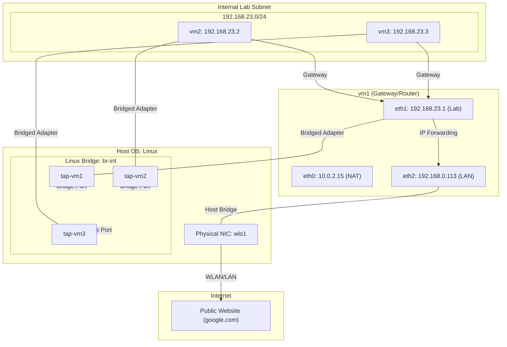

# VirtualBox Internal Mode with Linux Bridges

## Goal

Replicate the behavior of the VirtualBox **Internal Network** by manually creating a **Linux Bridge** (`br-int`) and **TAP interfaces** on the host. This lab establishes a private network on the **192.168.23.0/24** subnet where `vm2` and `vm3` act as clients and `vm1` serves as the gateway to the external network.

To achieve connectivity, we manually configure four critical networking functions:

1. **Host-Side Layer 2**: Creating the `br-int` bridge and the `tap-vmX` interfaces to provide the network connectivity.
2. **IPv4 Forwarding**: Enabling `vm1` to pass traffic between its internal interface (connected to the bridge) and its external interface (connected to the LAN).
3. **NAT Masquerade**: Translating the private client addresses into `vm1`'s bridged IP so the physical network can return traffic.
4. **Default Gateway**: Establishing `vm1` as the mandatory exit point for the client VMs to reach external networks.

## Summary of Linux Bridge Mode

In this lab, we replace the default VirtualBox internal networking mode with a **Linux Bridge** and **TAP interfaces**. This environment allows the host machine to directly monitor the network traffic between the virtual machines using standard Linux tools.

**Key Characteristics:**

- **Linux Bridge (Layer 2)**: The virtual switch is a standard Linux Bridge (`br-int`) created on the host. This acts as a standard unmanaged switch that forwards Ethernet frames between any connected TAP interfaces.
- **TAP Interface Connectivity**: Each VM is attached to the host bridge via a dedicated TAP interface. This treats the VM's virtual NIC as a physical-style attachment to a host-side port. The connection functions by mapping the virtual network card in the VM directly to a TAP device on the host via the hypervisor. When the guest OS sends an Ethernet frame, the hypervisor captures the raw data from the virtual card's memory and writes it into a file descriptor associated with the TAP interface. This action makes the frame appear inside the host's kernel as if it had arrived on a physical port. The host can then forward this traffic to a network bridge, effectively linking the VM's internal transmissions to the host's external networking stack.
- **Visibility**: Unlike VirtualBox's hidden internal mode, this bridge is a standard network interface on the host. You can use standard tools like `tcpdump` on the host to monitor the raw frames moving between the VMs.
- **Manual Service Configuration**: Like the internal network mode, the hypervisor provides no automated services. All Layer 3 logic, including IP addressing and routing, must be manually established within the guest operating systems.

## Network Topology (Linux Bridges)



**Understanding the Topology**

This diagram illustrates how the Linux Bridge provides the "wiring" for the lab. The environment is defined by the **Host OS**, the **Internal Subnet**, and the **External LAN**.

- **Host OS**: The Linux kernel manages the `br-int` bridge and the `tap-vmX` ports. This replaces the VirtualBox internal driver.
- **Internal Lab (`vm2`, `vm3`)**: These nodes reside on the private `192.168.23.0/24` subnet. Their only path to the internet is through the `eth1` interface of `vm1`.
- **The Gateway (`vm1`)**: This node bridges the manual internal segment with the physical LAN. It uses `eth1` to talk to the lab and `eth2` (bridged to the host's `wlo1`) to reach the internet.
- **Routing Logic**: `vm1` performs **IP Forwarding** to move packets between the two segments and **NAT (Masquerade)** to allow the internal nodes to share its external IP address.

## Key Learning Objectives

- Build a virtual network using fundamental Linux kernel primitives (`bridge`, `tuntap`).
- Understand how VirtualBox's "Bridged Adapter" mode can be used as a generic attachment mechanism for custom host interfaces.
- Observe and monitor raw inter-VM traffic from the host machine using standard networking tools.
- Configure kernel-level routing and translation to connect a manual segment to the internet.

## Prerequisites

- [VirtualBox](https://www.virtualbox.org/wiki/Downloads)
- [Vagrant](https://developer.hashicorp.com/vagrant/install)
- A Linux Host machine (required for Bridge/TAP support).

## Prerequisites inside the VM's

- curl: `sudo apt update & sudo apt install curl`

## The Vagrantfile [Configuration](./Vagrantfile)

### Technical Overview

The Vagrantfile automates both the host-side logic and the guest-side routing.

- **Host Automation**: Vagrant **Triggers** are used to interact with the host kernel.
  - `before :up`: Creates the `br-int` bridge and creates/attaches the TAP interfaces.
  - `after :destroy`: Cleans up the host interfaces to leave the system in its original state.
- **The Gateway (vm1)**:
  Configured with three interfaces: `eth0` (NAT/Mgmt), `eth1` (Bridge Link), and `eth2` (Physical LAN Link).
- **The Internal Nodes (vm2, vm3)**:
  Connected to the host bridge via dedicated TAPs. They utilize `vm1` as their default gateway.

---

## Foundational Experiments

Before proceeding, ensure you have completed the [essential experiments in the NAT lab](../NAT/LAB-GUIDE.md#some-basic-experiments). You should be comfortable using `ip route` to see where traffic is sent and `ip addr` to check if your network interfaces are active and have the correct IPs.

---

## Guided Experiments

### 1. Verifying Network Interface Assignments (All VMs)

**Objective**: Verify IP address assignments on all network interfaces to confirm connectivity to the NAT, internal, and external networks.

Run `ip -br a` on **each VM**.

**vm1 (The Gateway)**:

```bash
vagrant@vm1:~$ ip -br a
lo               UNKNOWN        127.0.0.1/8 ::1/128
eth0             UP             10.0.2.15/24 fe80::a00:27ff:fe8d:c04d/64
eth1             UP             192.168.23.1/24 fe80::a00:27ff:fe65:9803/64
eth2             UP             192.168.0.113/24 fe80::a00:27ff:fe19:c6bf/64
```

**vm2 & vm3 (The Clients)**:

```bash
vagrant@vm2:~$ ip -br a
lo               UNKNOWN        127.0.0.1/8 ::1/128
eth0             UP             10.0.2.15/24 fe80::a00:27ff:fe8d:c04d/64
eth1             UP             192.168.23.2/24 fe80::a00:27ff:fef8:c2e/64
```

**What this tells us**:

- **vm1 (The Gateway)**:
  - `eth1`: The interface connected to the manual host bridge (`br-int`) with IP `192.168.23.1`.
  - `eth2`: The interface connected to your physical LAN via a Bridged connection.
- **vm2 & vm3 (The Clients)**:
  - `eth1`: The interface connected to the manual host bridge. This is their only path to the lab subnet.

### 2. Inspecting the Routing Tables (All VMs)

**Objective**: Inspect the routing tables to verify how each VM identifies local and external network paths.

Run `ip route` on **each VM**.

**vm1 (The Gateway)**:

```bash
vagrant@vm1:~$ ip route
default via 192.168.0.1 dev eth2
10.0.2.0/24 dev eth0 proto kernel scope link src 10.0.2.15
192.168.0.0/24 dev eth2 proto kernel scope link src 192.168.0.113
192.168.23.0/24 dev eth1 proto kernel scope link src 192.168.23.1
```

**vm2 & vm3 (The Clients)**:

```bash
vagrant@vm2:~$ ip route
default via 192.168.23.1 dev eth1
10.0.2.0/24 dev eth0 proto kernel scope link src 10.0.2.15
192.168.23.0/24 dev eth1 proto kernel scope link src 192.168.23.2
```

**What this tells us**:

- **On vm1 (The Gateway)**:
  - Traffic for the internet exits via `eth2` toward the physical router (`192.168.0.1`).
  - Traffic for the lab nodes is sent directly out of `eth1`.
- **On the Clients (vm2 & vm3)**:
  - All non-local traffic is forced through `vm1` (`192.168.23.1`) via `eth1`.

### 2. Internal Connectivity: Direct vs. Routed Path

**Objective**: Determine if communication between `vm2` and `vm3` goes through the gateway (`vm1`) or directly over the internal bridge.

From `vm2`, ping `vm3` and then inspect the neighbor table:

```bash
ping -c 3 192.168.23.3
ip -4 neighbor show

vagrant@vm2:~$ ping -c3 192.168.23.3
PING 192.168.23.3 (192.168.23.3) 56(84) bytes of data.
64 bytes from 192.168.23.3: icmp_seq=1 ttl=64 time=0.381 ms
...
vagrant@vm2:~$ ip -4 neighbor show
192.168.23.3 dev eth1 lladdr 08:00:27:ca:f6:0c REACHABLE
192.168.23.1 dev eth1 lladdr 08:00:27:65:98:03 STALE
```

**Interpretation**:

1. **Direct Communication (Layer 2)**: Since the destination is in the same subnet, the OS uses the `scope link` route and performs an ARP request.
2. **The Evidence**: The presence of `vm3`'s MAC address in the neighbor table confirms that the frames traveled directly across the **Linux Bridge** without being routed by `vm1`.

### 3. Verifying the Router Service Configuration on vm1

**Objective**: Verify the configuration on `vm1` that enables it to route traffic and hide private IP addresses.

```bash
vagrant@vm1:~$ sudo sysctl net.ipv4.ip_forward
net.ipv4.ip_forward = 1

vagrant@vm1:~$ sudo iptables -t nat -L POSTROUTING
Chain POSTROUTING (policy ACCEPT)
target     prot opt source               destination
MASQUERADE  all  --  anywhere             anywhere
```

**NAT Mechanism**:

1.  **Ingress**: Packet from `vm2` arrives at `vm1` on `eth1`.
2.  **Forwarding**: `vm1` moves the packet to `eth2`.
3.  **Masquerade**: Before exiting `eth2`, the kernel replaces the source IP (`192.168.23.2`) with `vm1`'s LAN IP (`192.168.0.113`).
4.  **Egress**: The packet hits the physical network with a valid return address.

### 4. Path Validation (Traceroute)

**Objective**: Verify the multi-hop path to the internet.

```bash
vagrant@vm2:~$ traceroute 8.8.8.8
 1  192.168.23.1 (192.168.23.1)  0.652 ms
 2  192.168.0.1 (192.168.0.1)  16.678 ms
 3  ...
```

**Conclusion**: This confirms the path: `vm2` -> `vm1` -> `Physical Router` -> `Internet`.

### 5. Name Resolution and DNS

Internal nodes resolve names by routing DNS queries through `vm1`. Traceroute proves that UDP/53 traffic follows the default gateway path, making `vm1` critical for hostname resolution.

### 6. Service Visibility and Access Boundaries

- **Internal Nodes**: Are reachable from each other and from the gateway. They are **not** reachable from the host unless the bridge is given a host-side IP address (The "Expert's Corner" approach).
- **Gateway**: `vm1` is reachable from the host via its `eth2` interface on the physical LAN.

### 7. Host-Side Traffic Monitoring

**Objective**: Observe the Layer 2 and Layer 3 traffic directly from the host machine to verify the bridge operations.

`tcpdump` is a standard packet analyzer that captures and displays network traffic in real-time. It allows you to capture the raw data passing through a specific interface. In this experiment, we use it to monitor the host-managed virtual switch.

On the **host machine**, run the following command:

```bash
sudo tcpdump -i br-int
```

**Command breakdown**:

- `sudo`: Required for raw socket access.
- `-i br-int`: Specifies the interface to listen on (the virtual bridge).

While `tcpdump` is running, initiate a ping from **vm2** to **vm3**:

```bash
# Inside vm2
ping -c 2 192.168.23.3
```

**Essential Output Analysis**:

```text
1. ARP, Request who-has 192.168.23.3 tell 192.168.23.2, length 46
2. ARP, Reply 192.168.23.3 is-at 08:00:27:68:10:9c (oui Unknown), length 46
3. IP 192.168.23.2 > 192.168.23.3: ICMP echo request, id 1566, seq 1, length 64
4. IP 192.168.23.3 > 192.168.23.2: ICMP echo reply, id 1566, seq 1, length 64
```

**Technical Explanation**:

- **Line 1 (ARP Request)**: `vm2` sends a broadcast frame to the bridge asking for the MAC address of `192.168.23.3`.
- **Line 2 (ARP Reply)**: `vm3` receives the request and sends its MAC address (`08:00:27:68:10:9c`) back to `vm2`.
- **Line 3 (ICMP Request)**: With the MAC address resolved, `vm2` transmits the ping packet across the bridge.
- **Line 4 (ICMP Reply)**: `vm3` receives the packet and transmits the response.

**Conclusion**: The host can monitor this traffic because the Linux bridge (`br-int`) is a standard network interface on the host OS. This provides direct visibility into the communication between virtual machines that is not possible with VirtualBox's internal network mode.

---

## Key Takeaways

### 1. Direct Peer Communication

Nodes in the same subnet communicate directly at Layer 2. As shown in the neighbor table (Experiment 2), VM2 and VM3 discover each other's MAC addresses via ARP and exchange frames across the bridge without involving the gateway.

### 2. The Gateway as a Software Configuration

VM1 acts as a router because of its software state, not its hardware. By enabling IP forwarding and NAT (Experiment 3), we manually established the path for traffic to move between the private segment and the external network.

### 3. Traffic Path Control

The path traffic takes is determined by the routing table. By replacing the default route on the client VMs, we forced all external traffic to go through VM1. This change was verified by the traceroute results (Experiment 4).

### 4. Linux Bridge Frame Forwarding

The host bridge performs Layer 2 frame forwarding between the TAP interfaces to establish the shared network segment.
