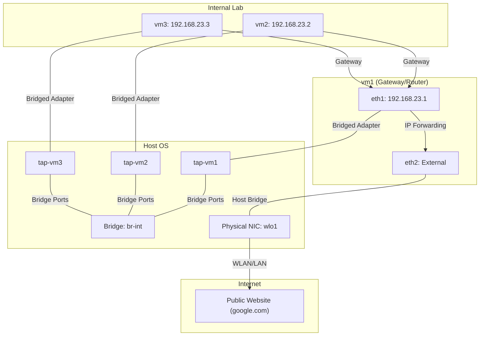

# Linux Bridges Lab: The Deep Dive

Welcome to the companion guide for our Linux Bridge laboratory. This guide explains the "why" behind the manual steps required to replicate the VirtualBox "Internal Network" mode using standard Linux kernel tools.

---

## 1. Network Topology & IP Plan

**The Goal:** To define the "Language" and "Geography" of our lab.

This setup mirrors the architecture found in `Internal/Vagrantfile`. We use the `192.168.23.0/24` subnet. VM1 acts as the central hub (Gateway), while VM2 and VM3 are private clients. In this pure implementation, the host remains transparent—it acts as the physical backplane but does not have an identity on the lab network itself.

### Visualizing the Topology

The following diagram shows how the Linux Bridge acts as the central switch, with TAP interfaces serving as the "virtual cables" between the host and the virtual machines. This setup provides total transparency, allowing you to monitor the internal "backplane" directly from the host.



---

## 2. Host Infrastructure Setup (Layer 2)

**The Goal:** To build the physical hardware (in software).

### The Bridge (`br-int`)

Think of this as a physical 8-port unmanaged switch. When you run `ip link add... type bridge`, the Linux kernel creates a virtual version of that hardware switch. It maintains a MAC address table and handles the switching of Ethernet frames between any devices "plugged" into it. It is a direct, open-source replacement for VirtualBox's proprietary `intnet` driver.

### The TAPs (`tap-vmX`)

If the Bridge is the switch, the TAPs are the **Ethernet cables**. A TAP is a virtual kernel device that acts like a physical wire. One end is plugged into the Linux bridge, and the other end is presented to VirtualBox. By using TAPs, we are taking the "wiring" responsibility away from VirtualBox and giving it to the Linux Host OS.

---

## 3. Understanding the "Bridged Adapter" Paradox

The mode you select in VirtualBox is **"Bridged Adapter"**.

I understand why this sounds contradictory. In most tutorials, "Bridged Mode" is presented as a high-level feature to get a VM onto your physical home/office network. However, at a fundamental level, VirtualBox's "Bridged Adapter" mode is simply a **generic attachment mechanism**. It tells VirtualBox: _"Take the Ethernet frames from this VM and inject them directly into a specific network interface on the host."_

In this configuration, VirtualBox is **completely stripped of its intelligence**:

- **No VBox NAT:** It isn't translating IP addresses.
- **No VBox DHCP:** It isn't handing out IPs.
- **No VBox Internal Logic:** It doesn't even know the other VMs exist.

VirtualBox simply thinks it is plugged into a physical wire (`tap-vm1`). The fact that `tap-vm1` is actually connected to a Linux Bridge (`br-int`) is a secret kept by the Host OS. In the Linux Bridge mode, you are the **Network Engineer** building the infrastructure. The reason we use the "Bridged Adapter" setting in VBox is simply because that is the name of the "plug" VBox provides to let a VM talk to a Host interface. But because that Host interface is a tap that **you** created, the "Internal Network" is now **owned by you**, not by VirtualBox.

_Note: You might wonder if "Host-Only" mode could be used instead. The answer is no. "Host-Only" is a managed mode where VirtualBox creates its own internal switch and host interface (e.g., `vboxnet0`). It does not allow you to specify a custom interface like `tap-vm1`. Only **"Bridged Adapter"** provides the generic capability to select a pre-existing host interface of your choice and use it as the VM's physical-style attachment point._

---

## 4. VirtualBox Hardware Mapping

**The Goal:** To ensure the virtual cables are plugged into the right virtual holes.

This section maps the physical concept of "plugging in a cable" to the VirtualBox settings.

- **Adapter 1 (NAT):** Retained for Vagrant management and SSH access.
- **Adapter 2 (The Lab):** This is the "Internal" NIC. We bridge it to our custom Host TAPs.
- **Adapter 3 (The Internet):** VM1 requires a third NIC bridged to the physical network to reach the internet.

---

## 5. Guest OS Configuration (Layer 3)

**The Goal:** To teach the VMs how to talk and find their way home.

### IP Addressing

Now that the "cables" are plugged in, the VMs need static IPs to communicate over the Layer 2 bridge.

### VM1: The Gateway Logic

- **IP Forwarding:** By enabling `ip_forward`, we turn VM1 into a functional router. It will now accept packets from VM2/VM3 and forward them to the external network.
- **NAT (Masquerade):** VM1 must translate the private `192.168.23.x` addresses into its own external IP so that the outside world can respond to the packets.

### The "Default Route"

This is critical for the clients. Every VM has a routing table. We replace the default NAT route with a route pointing to VM1 (`192.168.23.1`). This forces all external traffic to go through our laboratory router.

---

## 6. Technical Note: The Role of the Default Route in IP Forwarding

This assertion describes the fundamental difference between an **End Node** and a **Gateway**. It is the difference between having a "personal map" and a "public transit map."

### 1. The End Node Perspective (VM2)

For a non-router like VM2, the default route is a **Personal Exit**.

- **Context:** VM2's networking stack only processes packets that **originate** within its own applications.
- **The Route:** `default via 192.168.23.1 dev eth1`
- **Example:** You run `ping 8.8.8.8` inside VM2.
  - The OS creates a packet.
  - It looks at its personal exit (the default route).
  - It sends the packet out of `eth1`.
- **Constraint:** If VM2 were to somehow receive a packet from "outside" meant for `8.8.8.8`, it would drop it. It doesn't care about the default route for other people's traffic.

### 2. The Gateway Perspective (VM1)

For a router like VM1, the default route is a **Transit Direction**.

- **Context:** VM1's networking stack is configured to process packets that **did not originate** locally. It acts as an intermediary.
- **The Routes:**
  - `192.168.23.0/24 dev eth1 ...` (Entrance)
  - `default via 192.168.0.1 dev eth2` (Exit)
- **Example:** VM2 sends its `8.8.8.8` ping to VM1.
  - VM1 receives the packet on `eth1`.
  - Because it is a router, it doesn't drop the packet. Instead, it asks: _"I know where this came from (eth1), but where does the map say it should go?"_
  - The **`default`** route answers: _"Send it out of **eth2**."_

### Why the difference is important:

The **"IP Forwarding"** label in your diagram exists only because VM1 uses its default route to **connect two different interfaces.**

- **In VM2:** The default route is the **end of the line**.
- **In VM1:** The default route is a **junction**. It provides the instruction to move data from the "Lab" network interface to the "External" network interface.

Without the `default via ... dev eth2` line, VM1 would be a "black hole"—it would receive the packets on `eth1` but have no "map" to tell it which interface leads to the internet. Therefore, that specific route is what bridges the gap between the ingress (eth1) and the egress (eth2).

---

## 7. Verification & Monitoring

**The Goal:** To "see" the invisible.

Because we are using a Linux Bridge, the traffic is accessible on the host. When you run `tcpdump -i br-int`, you are monitoring the virtual "backplane." You can see the actual frames moving between the VMs, which provides a level of transparency that VirtualBox's hidden internal mode cannot offer.

---

## 8. Cleanup

**The Goal:** To leave no trace.

Since the bridge and TAPs are created in the kernel's memory, they must be manually deleted to reclaim resources. Deleting the bridge automatically detaches all ports, effectively "unplugging" the virtual lab.

---

## 9. The Expert's Corner: Transparent vs. Integrated Bridge

In our guide, we chose the **Transparent Bridge** approach (no IP address on the host's `br-int`). However, you might wonder: _"Should the host have an identity (IP address) on this network?"_

There is no single "correct" answer; it depends on whether your goal is **Architectural Purity** or **Practical Convenience**.

### What we GAIN with a Transparent Bridge (The "Pure" Approach)

- **Absolute Isolation:** The lab is a true "walled garden (isolated network)." The VMs cannot see or talk to your host machine. This is ideal for testing security tools or messy network services (like DHCP) that you don't want interfering with your host.
- **Learning Real-World Routing:** In a real production network, you don't usually have a "backdoor" (alternative route or direct access path) into a private internal subnet. By keeping the bridge transparent, you are forced to use VM1 as the "Front Door" (a Jump Host). This teaches you the discipline of managing remote, isolated segments.
- **Layer 2 Verification:** This proves the Linux Bridge is acting purely as a **Hardware Switch**. It is passing frames, not participating in the IP conversation.

### What we LOSE (The "Practical" Approach)

- **Direct Access:** You cannot SSH directly from your host terminal to VM2 or VM3. You must "hop" through (traverse) VM1 first.
- **Browser Testing:** If you run a web server on VM2, you cannot simply open your host's browser and visit `http://192.168.23.2`. You would need to configure Port Forwarding on VM1.
- **Host-to-Lab Troubleshooting:** If VM2 can't talk to VM1, you can't ping VM2 from your host to check if its NIC is active. You are "blind" (disconnected from the segment) from the host side.

### The Hybrid Compromise

One of the most powerful features of this setup is flexibility. You can keep the bridge transparent by default to maintain the "pure" lab environment, but "plug your laptop in" momentarily for debugging by running:

```bash
# Temporarily join the lab from the host
sudo ip addr add 192.168.23.254/24 dev br-int
```

When you are finished debugging, simply remove the IP to return to total isolation.

---

## 10. Technical Choice: TAP vs. VETH Interfaces

The choice between TAP and VETH interfaces comes down to whether you are connecting a **Process** or a **Namespace** to your bridge.

### TAP Interfaces (Used in your Lab)

In the context of your `config.md`, a TAP is a **single-ended virtual port**.

- **Role:** It acts as the "plug" on the host for the Virtual Machine.
- **Integration:** You create one TAP per VM and attach it directly to `br-int`. VirtualBox then "grabs" this specific interface.
- **Advantage for this Lab:** It is the simplest way to connect a Virtual Machine. Since VirtualBox is an external process that manages its own networking internally, it only needs one point of attachment on your host to send and receive frames.

### VETH Pairs (The Alternative)

A VETH is a **double-ended virtual cable**. To use it, you would have to manage two separate interfaces for every connection.

- **Role:** You would plug one end into the Bridge (`br-int`) and the other end into a different network environment (a Namespace).
- **Usage:** VETH is the standard for **Containers** (like Docker) because containers share the host's kernel and use Namespaces to stay isolated.
- **Disadvantage for this Lab:** Using a VETH pair here would add unnecessary complexity. You would have to manage two interfaces per VM, and VirtualBox would still require a TAP-like interface to interact with the "other end" of the VETH cable anyway.

### Why TAP was chosen over VETH:

We chose TAPs because they provide the **most direct path** between a VirtualBox VM and a Linux Bridge.

A TAP provides a single, named interface (e.g., `tap-vm1`) that serves as the entry point into your virtual switch. Since VirtualBox is designed to bridge to a host interface, the TAP acts as the perfect "virtual wire" for the hypervisor to attach to, without the overhead of managing the dual-ended architecture required by VETH pairs.

---

## 11. Layer 2 vs. Layer 3: Why Subnets Must Match

What ip route actually shows for a Local Link:
When you assign an IP to an interface, ip route shows an entry like this:
`192.168.23.0/24 dev eth1 proto kernel scope link src 192.168.23.1`

### The technical reality of "Local Link Logic":

The key term here is **scope link**.

1.  **Scope Link:** This is a specific attribute that tells the kernel: "This destination range is physically connected to this wire."
2.  **No Gateway:** Because it is scope link, the kernel knows there is no "next hop" or intermediate device.
3.  **Triggering Layer 2:** When a packet matches a scope link route, the kernel immediately triggers the ARP subsystem (for IPv4) or Neighbor Discovery (for IPv6).

The reason all nodes on the bridge must be in the same subnet is that the kernel only allows the use of Layer 2 (ARP) for destination IPs that match a route with scope link.

### The `scope link` Attribute as a Bridge

The scope link attribute in the routing table is the only mechanism that allows the kernel to bridge the gap between Layer 3 (IP) and Layer 2 (Ethernet).

1.  **The Subnet as a Permission:** When you define a subnet on an interface, the kernel creates a route with scope link. This route serves as a permission filter: it tells the kernel that for this specific IP range, it is authorized to use ARP (Layer 2) to find a destination.
2.  **Layer 2 Dependency:** A bridge only moves frames based on MAC addresses. It has no knowledge of IP addresses. To get a MAC address, the kernel must first decide to send an ARP request.
3.  **The Logical Block:** If a node's IP address is outside the scope link range of the sender, the kernel’s networking stack will not initiate an ARP request on that bridge. Even though the nodes are physically connected to the same switch, the software layer refuses to communicate at Layer 2 because the destination fails the subnet "on-link" check.

### Conclusion

Nodes must be in the same subnet because the **Subnet Route (scope link)** is the mandatory software trigger for the Layer 2 Discovery (ARP) required to talk across the bridge. Without matching subnets, the software never "talks" to the hardware.

---

## 12. Technical Note: Behind the Curtains - Fundamentals of Virtual Networking

Here are the three fundamental "behind the curtains" concepts we've surfaced that most papers ignore:

### 1. The "Logic Gate" of the Subnet Route

Most papers explain subnets as "address ranges." They miss the fact that the **`scope link`** route is a mandatory software trigger. Without it, the kernel refuses to even "look" at the Layer 2 hardware (ARP), regardless of whether a physical bridge exists. This is why "Recipes" fail when someone tries to use a non-standard IP range.

### 2. The Bridge as a Port-Aware Multiplexer

Many descriptions treat a Bridge like a simple hub that repeats everything. In reality, the Linux Bridge maintains a **Forwarding Database (FDB)**. It maps MAC addresses to specific TAP/VETH ports. Understanding that the Bridge is an active, port-aware decision-maker is what allows you to troubleshoot why one VM can talk but another cannot.

### 3. The "Carrier" Handshake

As we saw with your `NO-CARRIER` issue, the bridge isn't just a static device. It is a state-aware kernel object that requires a valid userspace process (the "Carrier") to be active. Most tutorials skip this, assuming the reader is doing everything in a single, persistent session, which hides the subtle timing and ownership issues that break automation.

---

## 13. Deep Dive: The Concept of the "Carrier" and Link Flags

In networking, a **Carrier** is the signal indicating that a physical or logical circuit is complete.

- **Physical hardware:** The carrier is provided by electrical voltage or light pulses from a connected switch.
- **TAP Interfaces:** The carrier is a **userspace-to-kernel handshake**. When a process (VirtualBox) opens the `/dev/net/tun` device associated with a TAP, the kernel senses the "file handle" is open and triggers the carrier.
- **Bridges:** A bridge's carrier state is an **aggregate**. By default, a bridge only has a carrier if at least one of its member ports (TAPs) has a carrier. If all VMs are off, the bridge itself will report `NO-CARRIER`.

### Anatomy of the `ip link` Flag Tuple

When you run `ip link`, every interface displays a set of flags inside `< >`. This list is the kernel's real-time assessment of the interface's health and capabilities.

Example: `<BROADCAST,MULTICAST,UP,LOWER_UP>`

| Flag           | Category             | Meaning                                                                            |
| :------------- | :------------------- | :--------------------------------------------------------------------------------- |
| **BROADCAST**  | Capability           | The interface supports sending to all nodes on the segment.                        |
| **MULTICAST**  | Capability           | The interface supports sending to specific groups of nodes.                        |
| **UP**         | Administrative State | The administrator has ordered the device to be active (`ip link set ... up`).      |
| **LOWER_UP**   | Operational State    | The physical/logical wire is "plugged in" at both ends. The handshake is complete. |
| **NO-CARRIER** | Operational State    | The wire is "unplugged" or the userspace process (Carrier) is missing.             |

### How to read the state combinations:

1.  **`<UP,LOWER_UP>`**: The "Gold Standard." The interface is on in software, and the physical/virtual circuit is complete. Data can flow.
2.  **`<UP>` (without LOWER_UP)**: The interface is "administratively on" but "operationally broken." This is what you see when a VM is off; the TAP is ready, but there is no carrier. Traffic sent here will be dropped.
3.  **`<BROADCAST,MULTICAST>`**: The interface is currently **OFF**. It has the capability to work, but the administrator hasn't turned it on yet.
4.  **`<NO-CARRIER,UP>`**: A warning state. You have turned it on, but the kernel is explicitly telling you that the other end of the wire (the VM process) is missing.
