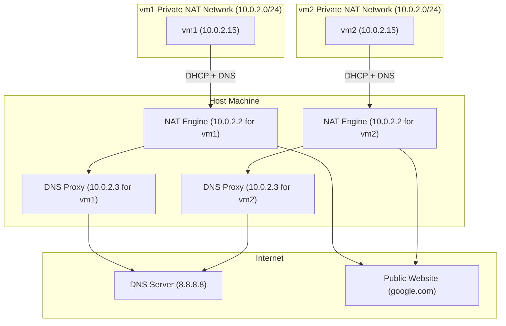

# VirtualBox Network Mode: NAT

## Key Learning Objectives

- Learn what NAT Network mode is.
- Understand and validate:
  - Interface IP addressing
  - Basic ping/ssh between VMs
  - Communication to the outside world

## Network Topology (VirtualBox NAT Mode)



**Understanding the Topology**

This diagram illustrates how VirtualBox NAT mode allows virtual machines to access the internet while remaining logically isolated.

*   **Private NAT Networks (`vm1`, `vm2`)**: Both virtual machines exist in their own private address space (`10.0.2.0/24`). Because each VM has the same IP (`10.0.2.15`), they are logically isolated from each other; they cannot communicate directly, even though they share the same subnet prefix.
*   **The VirtualBox NAT Engine (`10.0.2.2`)**: VirtualBox acts as a router/gateway for the VMs. It intercepts traffic leaving the VM and performs Source Network Address Translation (SNAT), replacing the VM’s private IP with the host machine's physical IP. This allows the host to send the traffic out to the internet on the VM's behalf.
*   **DNS Proxy (`10.0.2.3`)**: VirtualBox provides an internal DNS resolver. When a VM sends a DNS query to this address, VirtualBox captures it and forwards the request to your host's configured DNS servers. This allows VMs to resolve hostnames without needing their own direct path to external DNS servers.
*   **External Access**: Internet-bound traffic flows through the NAT engine, which maps the internal request to a public-facing IP, allowing the response to be correctly routed back through the NAT engine to the requesting VM.

***

## The Vagrantfile [Configuration](./Vagrantfile)

### Informal Explanation

The Vagrantfile is the script that tells Vagrant how to create and configure the two Debian virtual machines (`vm1` and `vm2`) for this NAT network lab.

Here’s the basic breakdown of what it does:

- **Base Box**  
  We use the official Debian 12 “bookworm” box as the starting image. This means both VMs will run a clean, minimal Debian system ready for networking experiments.

- **Defining Multiple VMs**  
  The file defines two separate VMs (`vm1` and `vm2`). Each VM gets its own hostname and VM name inside VirtualBox, so you can easily identify them.

- **Network Setup: NAT Mode**  
  Each VM’s first network interface is configured as NAT — the default VirtualBox mode. This means:
  - The VM can access the internet through VirtualBox’s built-in router.
  - The VM is isolated from the host and from each other (they cannot directly communicate).
  - An IP address is assigned automatically by VirtualBox’s DHCP server, typically in the `10.0.2.x` range.

- **VM Resources**  
  Each VM is assigned 1024MB of RAM — enough to run Debian comfortably without wasting host resources.

- **SSH Access**  
  Vagrant automatically configures SSH access so you can easily connect to each VM using `vagrant ssh vm1` or `vagrant ssh vm2`.

---

### What This Means in Practice

When you run `vagrant up`, Vagrant:

1. Downloads the Debian box if not already present.
2. Creates two separate VMs named `lab_nat_vm1` and `lab_nat_vm2`.
3. Configures their network interfaces to NAT mode.
4. Boots the VMs, each with its own isolated network stack.
5. Sets up port forwarding so you can connect via SSH seamlessly.

Inside the VMs, you’ll see that:

- Both have IP addresses like `10.0.2.15`, but they are isolated — pinging one from the other won’t work.
- Both can access the internet (try `ping 8.8.8.8` or `sudo apt update`).
- They cannot see each other or communicate directly, which is the key characteristic of NAT mode.

---

This configuration is great to test internet connectivity and practice with isolated VMs without worrying about IP conflicts or complex network setups.

---

### Networking Assumptions

Vagrant assumes there is an available NAT device on `eth0`. This ensures that Vagrant always has a way of communicating with the guest machine. It is possible to change this manually (outside of Vagrant), however, this may lead to inconsistent behavior. Providers might have additional assumptions. For example, in VirtualBox, this assumption means that network adapter 1 is a NAT device.

## Setup

Two Debian VMs provisioned with Vagrant and running on VirtualBox.

## Prerequisites

- [VirtualBox](https://www.virtualbox.org/wiki/Downloads)
- [Vagrant](https://developer.hashicorp.com/vagrant/install)

## Prerequisites inside the VM's

- Network Manager: `sudpo apt update & sudo apt install network-manager`
- jq: `sudo apt install jq`
- curl: `sudo apt install curl`

## Getting Started

1. Start both VMs: `vagrant up`
2. Open a terminal and connect to the first VM: `vagrant ssh vm1`
3. Open a terminal and connect to the second VM (if necessary): `vagrant ssh vm2`
4. To stop a VM: run `exit` and then `vagrant halt`

## Some Basic Experiments

### Checking Assigned IPv4 Addresses

Running `ip -4 address` shows a list of all network interfaces on the system, but only their IPv4-related information.

```bash
1: lo: <LOOPBACK,UP,LOWER_UP> mtu 65536 qdisc noqueue state UNKNOWN group default qlen 1000
    inet 127.0.0.1/8 scope host lo
       valid_lft forever preferred_lft forever
2: eth0: <BROADCAST,MULTICAST,UP,LOWER_UP> mtu 1500 qdisc fq_codel state UP group default qlen 1000
    altname enp0s3
    inet 10.0.2.15/24 brd 10.0.2.255 scope global dynamic eth0
       valid_lft 85363sec preferred_lft 85363sec
```

As a refresher, a _Network Interface Card_ (NIC or Network Adapter) is the physical hardware component that allows a computer to connect to a network, while a _network interface_ is a software-defined abstraction that represents that connection (NIC) in the operating system.

Thus, when you run `ip -4 address`, you're asking Linux to list all the IPv4 addresses currently assigned to your system's network interfaces. In this output, we see two interfaces:

- `lo` : loopback, for local communication
- `eth0` or `enp0s3` : a network interface representing VirtualBox's first virtual NIC, named as _Adapter 1_ in the VirtualBox Network settings.

For each interface, the output includes:

1. Interface name and status flags

- Example: `eth0 <BROADCAST,MULTICAST,UP,LOWER_UP>`.
- Key flags:
  - `UP`: Interface is active.
  - `LOWER_UP`: Physical link is connected (for hardware interfaces).
  - `LOOPBACK`: Identifies the loopback interface (`lo`).

2. IPv4 address and subnet

- Format: `inet <IP>/<subnet_mask>` (e.g., `inet 10.0.2.15/24`).

3. Additional IPv4 metadata

- Scope:
  - `host` (loopback, only visible locally).
  - `global` (public or LAN-facing addresses).

- Dynamic/static assignment:
  - `dynamic`: Address obtained via DHCP (with lease times like `valid_lft`).
  - `static`: No lease times (e.g., loopback’s `forever`).

- Broadcast address:
  - Listed as brd (e.g., `brd 10.0.2.255`).

From an informal perspective, the first interface, called `lo`, is a special virtual interface that allows the machine to talk to itself internally. It has the IP address `127.0.0.1`, commonly known as _localhost_ , and it's always available, with no expiration. The system uses this for internal communications, like when you test a web server running on your own machine.

Likewise, the second interface, `enp0s3`, is the actual network interface — the one connected to VirtualBox’s virtual network adapter. It’s active, has a working connection, and was automatically assigned the IP address `10.0.2.15` by VirtualBox’s built-in DHCP server. That address belongs to the `10.0.2.0/24` subnet, which means it's part of a private local network used by the VirtualBox NAT system. The interface is fully functional and ready to communicate with the outside world through the virtual router. The IP lease is valid for a set amount of time, after which it may be renewed. This is the address your VM uses to send and receive internet traffic, with VirtualBox translating it behind the scenes.

### Testing Basic Internet Connectivity (ICMP)

Running `ping -c 4 8.8.8.8` successfully reaches Google's public DNS server.

```bash
vagrant@vm1:~$ ping -c 4 8.8.8.8
PING 8.8.8.8 (8.8.8.8) 56(84) bytes of data.
64 bytes from 8.8.8.8: icmp_seq=1 ttl=255 time=55.2 ms
64 bytes from 8.8.8.8: icmp_seq=2 ttl=255 time=77.2 ms
64 bytes from 8.8.8.8: icmp_seq=3 ttl=255 time=90.7 ms
64 bytes from 8.8.8.8: icmp_seq=4 ttl=255 time=101 ms

--- 8.8.8.8 ping statistics ---
4 packets transmitted, 4 received, 0% packet loss, time 3128ms
rtt min/avg/max/mdev = 55.232/81.149/101.471/17.265 ms
```

### Testing Inter-VM Connectivity

- `ping vm1` (success if inside `vm1`, `failure`otherwise)
- `ping vm2` (success if inside `vm2`, `failure`otherwise)

### Inspecting the Routing Table

Running `ip route` will return an output similar to the following:

```bash
default via 10.0.2.2 dev eth0
10.0.2.0/24 dev eth0 proto kernel scope link src 10.0.2.15
```

The command above displays the kernel routing table from `vm1` - the rules the system uses to decide where to send packets. The output will be identical if the command in `vm2` as well. The basic syntax structure of a route rule (simplified) is the following:

```bash
[<destination>] [via <gateway>] dev <interface> [proto <protocol>] [scope <scope>] [src <source IP>] [metric <metric>]
```

Some comments:

- _Line 1_: "For all destinations I don't know how to reach directly ('default'), send packets to `10.0.2.2` via network interface `eth0`.
- _Line 2_: "If there is a need to talk to any device in the local network `10.0.2.x`, send it directly out via interface `eth0` (no gateway needed). Use IP `10.0.2.15` when sending packets out this route".

The routes labeled `proto kernel` were added dynamically by the DHCP

if you run `ip -j route show | jq` you can the above table in JSON (You will have to run `sudo apt install jq`).

```bash
[
  {
    "dst": "default",
    "gateway": "10.0.2.2",
    "dev": "eth0",
    "flags": []
  },
  {
    "dst": "10.0.2.0/24",
    "dev": "eth0",
    "protocol": "kernel",
    "scope": "link",
    "prefsrc": "10.0.2.15",
    "flags": []
  }
]
```

### Transferring files into a Vagrant VM

In NAT mode, Virtual Box places the VM behind an internal NAT router. This means the VM doesn't have a directly reachable IP address from the host. To connect to the VM (e.g., via `SSH` or `SCP`), _port forwarding must be used_, and Vagrant automatically sets this up (e.g., forwarding host port `2222` to guest port `22`).

To copy a file into a Vagrant VM from your host, you can use the `scp` command like this:

```bash
scp -P <port-number> \
    -i <path-to-private-key-file> \
       <path-to-file-on-host> \
       vagrant@127.0.0.1:/home/vagrant/<target-file>
```

Note that to get the correct port-number (usually is `2222`), you have to run `vagrant ssh-config vm1`.
As an example, to see a table of all interfaces and corresponding IP and MAC addresses, ensure you are in the _root folder of this project_ and run the following command from your host machine to copy the shell script into the home folder of `vm1`:

```bash
scp -P 2222 \
-i NAT/.vagrant/machines/vm1/virtualbox/private_key \
Scripts/table-ips-macs.sh \
vagrant@127.0.0.1:/home/vagrant/table-ips-macs.sh
```

Then, from the `home/vagrant`folder run:

```bash
chmod +x ./table-ips-macs.sh
./table-ips-macs.sh
```

You should get an output similar to the following:

```bash
=== Interface Information with Neighbors ===

Interface: eth0
  - Your IP:  10.0.2.15/24
  - Your MAC: 08:00:27:8d:c0:4d
  - Neighbors:
      • 10.0.2.2        → 52:55:0a:00:02:02 (REACHABLE)

Interface: lo
  - Your IP:  127.0.0.1/8
  - Your MAC: 00:00:00:00:00:00
  - Neighbors: (loopback — no neighbors)
```

To see only the _ARP/Neighbor table - the mapping between \_IP addresses_ and _MAC addresses_ on the same local network, run `ip -4 neigh show`:

```bash
10.0.2.2 dev eth0 lladdr 52:55:0a:00:02:02 REACHABLE
```

In the output above, `lladdr`stands for `link layer (layer 2) address. Sometimes we see the state `STALE`instead of 
`REACHABLE`. The state `STALE`says, informally : "We know the MAC address of`10.0.2.3`, but we haven't talked to it recently. If we need to use it again, we'll test if it's still alive." Indeed, if you  run `ping -c 3 8.8.8.8`and right after`ip -4 neigh show` again, you should get the above output.

### Demonstrating NAT Translation with Port Forwarding

To observe NAT address translation, set up port forwarding to expose a VM service, showing source IP translation.

1. **Modify Vagrantfile** (edit `/home/alfio/code/vagrant-vbox-labs/NAT/Vagrantfile`):

   ```ruby
   ["vm1", "vm2"].each do |name|
     config.vm.define name do |node|
       # ... existing config ...
       if name == "vm1"
         node.vm.network "forwarded_port", guest: 8080, host: 8081
       end
       # ... rest of config ...
     end
   end
   ```

2. **Exit SSH session and reload VM** (if inside vm1, run `exit` first):

   ```bash
   vagrant reload vm1
   ```

3. **Start HTTP server in vm1** (run in background to keep terminal available):

   ```bash
   vagrant ssh vm1
   python3 -m http.server 8080 &
   ```

4. **Connect from host** (open in browser):

   Open http://localhost:8081 in your web browser.

5. **Verify NAT translation**:
   If the page loads successfully in the browser, NAT translation is working. The host's request was routed through VirtualBox's NAT gateway (10.0.2.2) to the VM's service on port 8080, proving address translation in action.

## Key Takeaways

- VirtualBox's **NAT mode** creates a private, isolated virtual network for the VM(s).
- Each VM receives an IP like `10.0.2.15`, assigned by VirtualBox’s internal **DHCP server**.
- The **default gateway** (`10.0.2.2`) is a VirtualBox NAT router that forwards outbound traffic to the host's network.
- VM traffic can **reach the internet**, but **other VMs can't reach each other** directly.
- Tools like `ip route`, `ip neigh` provide insights into routing, ARP/neighbor state, and configuration.
- The VM’s routing table and ARP cache are dynamically built during boot by the DHCP client.
- The state of ARP entries (like `REACHABLE` or `STALE`) indicates recent communication activity.
