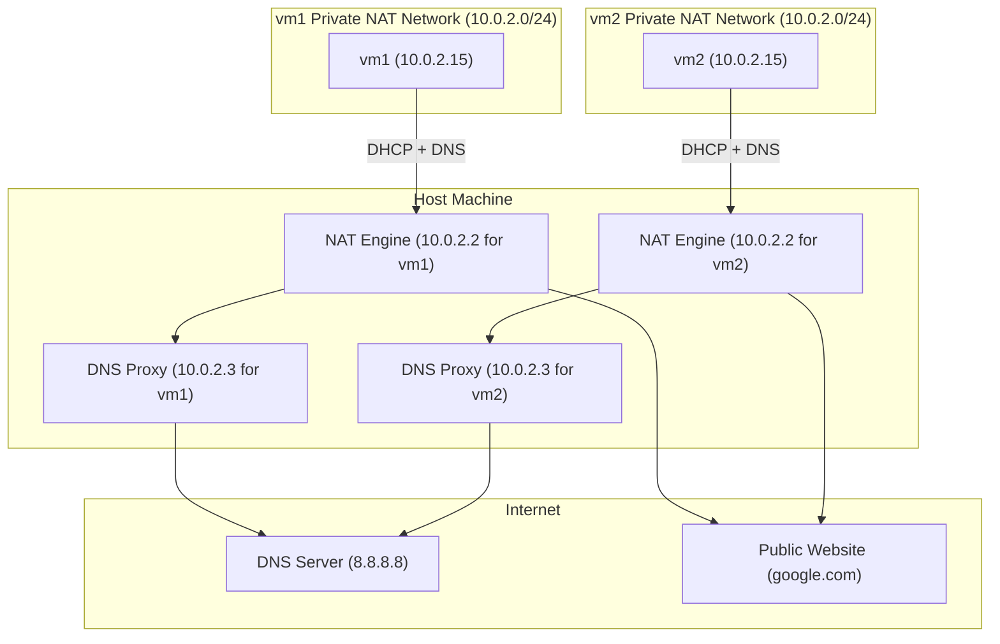

# VirtualBox Network Mode: NAT

<!-- TOC --> 
- [VirtualBox Network Mode: NAT](#virtualbox-network-mode-nat)
  - [Goal](#goal)
  - [Summary of NAT Mode](#summary-of-nat-mode)
  - [Key Learning Objectives](#key-learning-objectives)
  - [Network Topology (VirtualBox NAT Mode)](#network-topology-virtualbox-nat-mode)
  - [The Vagrantfile Configuration](#the-vagrantfile-configuration)
    - [Informal Explanation](#informal-explanation)
    - [What This Means in Practice](#what-this-means-in-practice)
    - [Networking Assumptions](#networking-assumptions)
  - [Setup](#setup)
  - [Prerequisites](#prerequisites)
  - [Prerequisites inside the VM's](#prerequisites-inside-the-vms)
  - [Getting Started](#getting-started)
  - [Some Basic Experiments](#some-basic-experiments)
    - [Checking Assigned IPv4 Addresses](#checking-assigned-ipv4-addresses)
    - [Testing Basic Internet Connectivity (ICMP)](#testing-basic-internet-connectivity-icmp)
    - [Verifying Internet Access via Package Manager](#verifying-internet-access-via-package-manager)
    - [Testing Inter-VM Connectivity](#testing-inter-vm-connectivity)
    - [Inspecting the Routing Table](#inspecting-the-routing-table)
    - [Getting SSH Connection Details for Vagrant VM](#getting-ssh-connection-details-for-vagrant-vm)
    - [Transfering files into a Vagrant VM](#transfering-files-into-a-vagrant-vm)
    - [Observing NAT in Action (Why This Matters)](#observing-nat-in-action-why-this-matters)
    - [Getting a Full Snapshot of Network Interface Configuration](#getting-a-full-snapshot-of-network-interface-configuration)
  - [Key Takeaways](#key-takeaways)
  - [Summary of Useful Commands](#summary-of-useful-commands)
    - [Vagrant and Virtual Box Commands:](#vagrant-and-virtual-box-commands)
    - [Linux Networking Commands (Inside VM)](#linux-networking-commands-inside-vm)

<!-- /TOC -->

## Goal
Understand how the NAT (Network Address Translation) network mode works in VirtualBox, especially how VMs communicate with the outside world (e.g., the Internet), and why they can’t talk to each other. The virtual machines used in this Lab are defined with a [Vagrantfile](./Vagrantfile). This Lab was inspired by the excelent [article/post](https://www.nakivo.com/blog/virtualbox-network-setting-guide/) on VirtualBox Network Settings by the Nakivo Team.

## Summary of NAT Mode 

This network mode is enabled for a virtual network adapter by default. A guest operating system on a VM can access hosts in a physical local area network (LAN) by using a virtual NAT (Network Address Translation) device. External networks, including the internet, are accessible from a guest OS in the VM. A guest machine (a VM) is not accessible from a host machine, or from other machines in the network when the NAT mode is used for VirtualBox networking. This default network mode is sufficient for users who wish to use a VM just for internet access, for example.

The IP address of the VM network adapter is obtained via DHCP and the IP addresses of the network used in this network mode cannot be changed in the GUI. VirtualBox has a built-in DHCP server and NAT engine. A virtual NAT device uses the physical network adapter of the VirtualBox host as an external network interface. The default address of the virtual DHCP server used in the NAT mode is `10.0.2.2` (this is also the IP address of the default gateway for a VM). The network mask is `255.255.255.0`.

If you configure the network adapters of two or more VMs to use the NAT mode, each VM will obtain the 10.0.2.15 IP address in its own isolated network behind a private virtual NAT device. The default gateway for each VM is `10.0.2.2`. 

Long story short, we have:

- Default VirtualBox mode.
- VM's gets a private IP from a hidden internal VirtualBox NAT router.
- VM's can reach the Internet, but cannot receive unsolicited connections from the host or other VMs.
- Each VM is isolated from the others.
- Ideal for downloading packages and OS updates with basic connectivity.

## Key Learning Objectives

- Learn what Internal Network mode is.
- [Configure with Vagrant](./Vagrantfile) two or more VMs to communicate only within an isolated VirtualBox network.
- Understand and validate:
    - Interface IP addressing
    - Basic ping/ssh between VMs
    - Communication to the outside world

## Network Topology (VirtualBox NAT Mode)



## The Vagrantfile [Configuration](./Vagrantfile)

### Informal Explanation 

The Vagrantfile is the script that tells Vagrant how to create and configure the two Ubuntu virtual machines (`vm1` and `vm2`) for this NAT network lab.

Here’s the basic breakdown of what it does:

- **Base Box**  
  We use the official Ubuntu 22.04 “jammy64” box as the starting image. This means both VMs will run a clean, minimal Ubuntu system ready for networking experiments.

- **Defining Multiple VMs**  
  The file defines two separate VMs (`vm1` and `vm2`). Each VM gets its own hostname and VM name inside VirtualBox, so you can easily identify them.

- **Network Setup: NAT Mode**  
  Each VM’s first network interface (`enp0s3`) is configured as NAT — the default VirtualBox mode. This means:
  - The VM can access the internet through VirtualBox’s built-in router.
  - The VM is isolated from the host and from each other (they cannot directly communicate).
  - An IP address is assigned automatically by VirtualBox’s DHCP server, typically in the `10.0.2.x` range.

- **VM Resources**  
  Each VM is assigned 512MB of RAM — enough to run Ubuntu comfortably without wasting host resources.

- **VirtualBox Customization**  
  We explicitly tell VirtualBox to use NAT mode by modifying the VM’s network adapter directly via `vb.customize`. This ensures the network mode is exactly what we want.

- **SSH Access**  
  Vagrant automatically configures SSH access so you can easily connect to each VM using `vagrant ssh vm1` or `vagrant ssh vm2`.

---

### What This Means in Practice

When you run `vagrant up`, Vagrant:

1. Downloads the Ubuntu box if not already present.
2. Creates two separate VMs named `lab1_vm1` and `lab1_vm2`.
3. Configures their network interfaces to NAT mode.
4. Boots the VMs, each with its own isolated network stack.
5. Sets up port forwarding so you can connect via SSH seamlessly.

Inside the VMs, you’ll see that:

- Both have IP addresses like `10.0.2.15`, but they are isolated — pinging one from the other won’t work.
- Both can access the internet (try `ping 8.8.8.8` or `sudo apt update`).
- They cannot see each other or communicate directly, which is the key characteristic of NAT mode.

---

This configuration is great to test internet connectivity and practice with isolated VMs without worrying about IP conflicts or complex network setups.

---

### Networking Assumptions

Vagrant assumes there is an available NAT device on `eth0`. This ensures that Vagrant always has a way of communicating with the guest machine. It is possible to change this manually (outside of Vagrant), however, this may lead to inconsistent behavior. Providers might have additional assumptions. For example, in VirtualBox, this assumption means that network adapter 1 is a NAT device.

## Setup
Two Ubuntu VMs provisioned with Vagrant and running on VirtualBox.

## Prerequisites 
- [VirtualBox](https://www.virtualbox.org/wiki/Downloads)
- [Vagrant](https://developer.hashicorp.com/vagrant/install)

## Prerequisites inside the VM's
- Network Manager: `sudo apt install network-manager`
- jq: `sudo apt install jq`

## Getting Started
1. Start both VMs: `vagrant up`
2. Open a terminal and connect to the first VM: `vagrant ssh vm1`
3. Open a terminal and connect to the second VM (if necessary): `vagrant ssh vm2`
4. To stop a VM: run `exit` and then `vagrant halt`

## Some Basic Experiments

### Checking Assigned IPv4 Addresses
  
Running `ip -4 address` shows a list of all network interfaces on the system, but only their IPv4-related information. 
 

   ```bash
    1: lo: <LOOPBACK,UP,LOWER_UP> mtu 65536 qdisc noqueue state UNKNOWN group default qlen 1000
    inet 127.0.0.1/8 scope host lo
       valid_lft forever preferred_lft forever
    2: enp0s3: <BROADCAST,MULTICAST,UP,LOWER_UP> mtu 1500 qdisc fq_codel state UP group default qlen 1000
    inet 10.0.2.15/24 metric 100 brd 10.0.2.255 scope global dynamic enp0s3
       valid_lft 81625sec preferred_lft 81625sec
   ```
As a refresher, a _Network Interface Card_ (NIC  or Network Adapter) is the physical hardware component that allows a computer to connect to a network, while a _network interface_ is a software-defined abstraction that represents that connection (NIC) in the operating system.

Thus, when you run `ip -4 address`, you're asking Linux to list all the IPv4 addresses currently assigned to your system's network interfaces. In this output, we see two interfaces:

- `lo` (loopback, for local communication)
- `enp0s3` (a network interface representing VirtrualBox's first virtual NIC, named as _Adapter 1_ in the VirtualBox Network settings).

For each interface, the output includes:

1. Interface name and status flags
  - Example: `enp0s3: <BROADCAST,MULTICAST,UP,LOWER_UP>`.
  - Key flags:
      - `UP`: Interface is active.
      - `LOWER_UP`: Physical link is connected (for hardware interfaces).
      - `LOOPBACK`: Identifies the loopback interface (`lo`).

2. IPv4 address and subnet
  - Format: `inet <IP>/<subnet_mask>` (e.g., `inet 10.0.2.15/24`).

3. Additional IPv4 metadata
  - Scope:
    - `host` (loopback, only visible locally).
    - `global` (public or LAN-facing addresses).

  - Dynamic/static assignment:
    - `dynamic`: Address obtained via DHCP (with lease times like `valid_lft`).
    - `static`: No lease times (e.g., loopback’s `forever`).

  - Broadcast address:
    - Listed as brd (e.g., `brd 10.0.2.255`).

From an informal perspective, the first interface, called `lo`, is a special virtual interface that allows the machine to talk to itself internally. It has the IP address `127.0.0.1`, commonly known as _localhost_ , and it's always available, with no expiration. The system uses this for internal communications, like when you test a web server running on your own machine.

Likewise, the second interface, `enp0s3`, is the actual network interface — the one connected to VirtualBox’s virtual network adapter. It’s active, has a working connection, and was automatically assigned the IP address `10.0.2.15` by VirtualBox’s built-in DHCP server. That address belongs to the `10.0.2.0/24` subnet, which means it's part of a private local network used by the VirtualBox NAT system. The interface is fully functional and ready to communicate with the outside world through the virtual router. The IP lease is valid for a set amount of time, after which it may be renewed. This is the address your VM uses to send and receive internet traffic, with VirtualBox translating it behind the scenes.


### Testing Basic Internet Connectivity (ICMP)

Running `ping -c3 8.8.8.8`  successfully  reaches  Google's public DNS server.

```bash
PING 8.8.8.8 (8.8.8.8) 56(84) bytes of data.
64 bytes from 8.8.8.8: icmp_seq=1 ttl=255 time=41.2 ms
64 bytes from 8.8.8.8: icmp_seq=2 ttl=255 time=37.3 ms
64 bytes from 8.8.8.8: icmp_seq=3 ttl=255 time=36.8 ms

--- 8.8.8.8 ping statistics ---
3 packets transmitted, 3 received, 0% packet loss, time 2013ms
```

### Verifying Internet Access via Package Manager

The command  `sudo apt update` can also be run successfully, i.e, the external internet 
is reachable.

```bash
sudo apt update
Get:1 http://security.ubuntu.com/ubuntu jammy-security InRelease [129 kB]
Hit:2 http://archive.ubuntu.com/ubuntu jammy InRelease
Get:3 http://archive.ubuntu.com/ubuntu jammy-updates InRelease [128 kB]
Get:4 http://archive.ubuntu.com/ubuntu jammy-backports InRelease [127 kB]
Get:5 http://archive.ubuntu.com/ubuntu jammy-backports/main amd64 Packages [68.8 kB]
Get:6 http://archive.ubuntu.com/ubuntu jammy-backports/universe amd64 Packages [30.0 kB]
Fetched 483 kB in 3s (190 kB/s)
Reading package lists... Done
Building dependency tree... Done
Reading state information... Done
77 packages can be upgraded. Run 'apt list --upgradable' to see them.
```
### Testing Inter-VM Connectivity

- `ping vm1` (success if inside `vm1`, `failure`otherwise)
- `ping vm2` (success if inside `vm2`, `failure`otherwise)

### Inspecting the Routing Table

Running  `ip route` will return an output similar to the following:

```bash
default via 10.0.2.2 dev enp0s3 proto dhcp src 10.0.2.15 metric 100 
10.0.2.0/24 dev enp0s3 proto kernel scope link src 10.0.2.15 metric 100 
10.0.2.2 dev enp0s3 proto dhcp scope link src 10.0.2.15 metric 100 
10.0.2.3 dev enp0s3 proto dhcp scope link src 10.0.2.15 metric 100 
```

The command above displays the kernel routing table from `vm1` - the rules the system uses to decide where to send packets. The output will be identical if the command in `vm2` as well. The basic syntax structure of a route rule (simplified) is the following:

```bash
[<destination>] [via <gateway>] dev <interface> [proto <protocol>] [scope <scope>] [src <source IP>] [metric <metric>]
```

Some comments:

- _Line 1_: "For all destinations I don't know how to reach directly ('default'), send packets to `10.0.2.2` via network interface `enp0s3`. I got this info from DHCP. Use 10.0.2.15 as an IP  address when sending, and assign value `100`to this rule. ".
- _Line 2_: "If there is a need to talk to any device in the local network `10.0.2.x`, send it directly out via interface `enp0s3` (no gateway needed). Use IP `10.0.2.15` when sending packets out this route".
- _Line 3_:"Here is a specific route to `10.0.2.2`(the NAT router/gateway), reachable directly via `enp0s3`. Use IP `10.0.2.15` when sending packets out this route".
- _Line 4_: "To reach the DNS Proxy Server (`10.0.2.3`), go out via `enp0s3`. It's directly reachable. Use IP `10.0.2.15` when sending packets out this route."

The routes labeled `proto dchp` were added dynamically  by the DHCP client when the VM booted and got its IP/gateway/DNS information. The routes labeled `proto kernel` were added dynamically by the DHCP

if you run `ip -j route show | jq`  you can the above table in JSON (You will have to run `sudo apt install jq`).

```bash
[
  {
    "dst": "default",
    "gateway": "10.0.2.2",
    "dev": "enp0s3",
    "protocol": "dhcp",
    "prefsrc": "10.0.2.15",
    "metric": 100,
    "flags": []
  },
  ...
]
```

You can get the IP address of the DNS and DHCP servers running `networkctl status`:

```bash
 State: routable                         
  Online state: online                           
       Address: 10.0.2.15 on enp0s3
                fd00::41:72ff:fefd:616c on enp0s3
                fe80::41:72ff:fefd:616c on enp0s3
       Gateway: 10.0.2.2 on enp0s3
                fe80::2 on enp0s3
           DNS: 10.0.2.3
```
Thus, our VMs don't talk directly to a real DNS server (like `8.8.8.8`, Google's public DNS server or your Internet Service Provider's servers). Instead, it sends DNS queries `10.0.2.3`, and Virtual Box forwards them _on the host's behalf_.

### Getting SSH Connection Details for Vagrant VM

Running `vagrant ssh-config vm1` prints the full SSH configuration that Vagrant has set up for connecting to the VM named `vm1`.

```bash
Host vm1
  HostName 127.0.0.1
  User vagrant
  Port 2222
  UserKnownHostsFile /dev/null
  StrictHostKeyChecking no
  PasswordAuthentication no
  IdentityFile C:/Users/alfio/Code/Labs/vagrant-vbox-labs/NAT/.vagrant/machines/vm1/virtualbox/private_key
  IdentitiesOnly yes
  LogLevel FATAL
  PubkeyAcceptedKeyTypes +ssh-rsa
  HostKeyAlgorithms +ssh-rsa
```

This includes:
- The _SSH port_ on the host machine (usually a high-numbered port like `2222`).
- The user (typically `vagrant`).
- The path to the _private SSH key file_ that authenticates the connection.
- It also includes SSH options that disable host key checking, specify the loggin level, and define the connection parameters used over the forwarded port.

The host's forwarded port (`2222`) is a port that acts like a brdige to the VM's SSH port (usally `22`).

### Transfering files into a Vagrant VM

In NAT mode, Virtual Box places the VM behind an internal NAT router. This means the VM doesn't have a directly reachable IP address from the host. To connect to the VM (e.g., via `SSH` or `SCP`), _port forwarding must be used_, and Vagrant automatically sets this up (e.g., forwarding host port `2222` to guest port `22`).

To copy a file into a Vagrant VM from your host, you can use the `scp` command like this:

```bash
scp -P <port-number> \
    -i <path-to-private-key-file> \
       <path-to-file-on-host> \
       vagrant@127.0.0.1:/home/vagrant/<target-file>  
```

Thus, to see a table of all interfaces and corresponding IP and MAC addresses, go to the root folder of this project
and run the following command to copy the shell script into the home folder of `vm1`:

```bash
scp -P <port-number> -i C:/Users/alfio/Code/Vagrant/virtual-box-network-modes/NAT/.vagrant/machines/vm1/virtualbox/private_key Scripts/table-ips-macs.sh vagrant@127.0.0.1:/home/vagrant/table-ips-macs.sh
``` 

Note that to get the correct port-number, you have to run `vagrant ssh-config vm1` first as explained above.

Then, from the `home/vagrant`folder run:

```bash
chmod +x ./table-ips-macs.sh
./table-ips-macs.sh
```

You should get an output similar to the following:

```bash
=== Interface Information with Neighbors ===

Interface: enp0s3
  - Your IP:  10.0.2.15/24
  - Your MAC: 02:41:72:fd:61:6c
  - Neighbors:
      • 10.0.2.3        → 52:55:0a:00:02:03 (REACHABLE)
      • 10.0.2.2        → 52:55:0a:00:02:02 (REACHABLE)

Interface: lo
  - Your IP:  127.0.0.1/8
  - Your MAC: 00:00:00:00:00:00
  - Neighbors: (loopback — no neighbors)
```

To see only the _ARP/Neighbor table - the mapping between _IP addresses_ and _MAC addresses_ on the same local network, run `ip -4 neigh show`:

```bash
10.0.2.2 dev enp0s3 lladdr 52:55:0a:00:02:02 REACHABLE
10.0.2.3 dev enp0s3 lladdr 52:55:0a:00:02:03 STALE
```

In the output above, `lladdr`stands for `link layer (layer 2) address. The state `STALE` says, informally : "We know the MAC address of `10.0.2.3`, but we haven't talked to it recently. If we need to use it again, we'll test if it's still alive."

Indeed, one you run, for instance, we run `ping -c 3 google` and right after `ip -4 neigh show` again, we get:

```bash
10.0.2.2 dev enp0s3 lladdr 52:55:0a:00:02:02 REACHABLE
10.0.2.3 dev enp0s3 lladdr 52:55:0a:00:02:03 REACHABLE
```

### Observing NAT in Action (Why This Matters)

One of the best ways to confirm that VirtualBox’s NAT mode is working correctly is to check how the outside world sees your VM. For that, we can run a command like `curl ifconfig.me` inside the VM:

```bash
vagrant@vm1:~$ curl ifconfig.me; echo
189.6.144.6
```
 
This tells us the public IP address the internet sees. You might expect to see a `10.x.x.x` address (like the one the VM itself has), but instead you'll get your actual public IP — the same one you’d see if you ran the command from your host machine. That’s not a mistake — it’s a demonstration of how Source NAT (SNAT) works.

Here's what’s happening: the VM sends packets from its private IP (`10.0.2.15`) to the NAT engine (`10.0.2.2`). The NAT engine rewrites the source IP to look like it came from your host's IP (e.g., `192.168.0.65` on Wi-Fi). Then, your home router performs another NAT step, translating that local address to your public IP (like `189.6.144.6`). This layered process is called double NAT, and it's what allows isolated VMs to access the internet while remaining invisible from it.

This experiment gives you direct, visible confirmation that your VM’s traffic is being translated and routed correctly — a key part of understanding how NAT mode works behind the scenes.

### Getting a Full Snapshot of Network Interface Configuration

To finalize, the command `nmcli device show` (`sudo apt install network-manager`) gives a complete snapshot of every detected network interface, showing device name, MAC address, MTU, IP addresses, routes, gateway, DNS servers, etc.

```bash
GENERAL.DEVICE:                         enp0s3
GENERAL.TYPE:                           ethernet
GENERAL.HWADDR:                         02:41:72:FD:61:6C
GENERAL.MTU:                            1500
GENERAL.STATE:                          10 (unmanaged)
GENERAL.CONNECTION:                     --
GENERAL.CON-PATH:                       --
WIRED-PROPERTIES.CARRIER:               on
IP4.ADDRESS[1]:                         10.0.2.15/24
IP4.GATEWAY:                            10.0.2.2
IP4.ROUTE[1]:                           dst = 10.0.2.0/24, nh = 0.0.0.0, mt = 100
IP4.ROUTE[2]:                           dst = 10.0.2.2/32, nh = 0.0.0.0, mt = 100
IP4.ROUTE[3]:                           dst = 0.0.0.0/0, nh = 10.0.2.2, mt = 100
IP4.ROUTE[4]:                           dst = 10.0.2.3/32, nh = 0.0.0.0, mt = 100
```

In the output above, `nh` means next hop, and hence `nh=0.0.0.0` means no next hop -- all hosts in `10.0.2.x` are directly connected.

## Key Takeaways

- VirtualBox's **NAT mode** creates a private, isolated virtual network for the VM(s).
- Each VM receives an IP like `10.0.2.15`, assigned by VirtualBox’s internal **DHCP server**.
- The **default gateway** (`10.0.2.2`) is a VirtualBox NAT router that forwards outbound traffic to the host's network.
- VM traffic can **reach the internet**, but **other VMs can't reach each other** directly.
- DNS is handled by a proxy at `10.0.2.3`, which forwards queries to the host's real DNS server.
- Tools like `ip route`, `ip neigh`, and `nmcli device show` provide insights into routing, ARP/neighbor state, and configuration.
- The VM’s routing table and ARP cache are dynamically built during boot by the DHCP client.
- The state of ARP entries (like `REACHABLE` or `STALE`) indicates recent communication activity.


## Summary of Useful Commands

### Vagrant and Virtual Box Commands:

| Command                                                                 | Description                                                       |
|-------------------------------------------------------------------------|-------------------------------------------------------------------|
| `vagrant up`                                                            | Starts and provisions all machines defined in the Vagrantfile.   |
| `vagrant halt`                                                          | Shuts down the running VM.                                       |
| `vagrant destroy <vmid>`                                               | Destroys the specified VM completely.                            |
| `vagrant global-status --prune`                                        | Lists all known Vagrant environments and removes stale ones.      |
| `vagrant ssh <vm>`                                                     | SSH into the given VM.                                           |
| `vagrant ssh-config <vm>`                                              | Shows SSH config (ports, private keys, hostname) for a VM.       |
| `VBoxManage list natnetworks`                                          | Lists all existing VirtualBox NAT Networks.                      |
| `VBoxManage natnetwork add --netname <name> --network <cidr> --enable --dhcp on` | Creates a new NAT Network with DHCP.                   |
| `VBoxManage natnetwork remove --netname <name>`                        | Deletes an existing NAT network.                                 |

### Linux Networking Commands (Inside VM)

| Command                                     | Description                                                                 |
|--------------------------------------------|-----------------------------------------------------------------------------|
| `ip -4 address`                             | Show IPv4 addresses assigned to each network interface.                    |
| `ip route`                                  | Show IPv4 routing table.                                                   |
| `ip -j route show \| jq`                    | Show the route table in JSON format (with `jq`).                           |
| `ip -4 neigh show`                          | Show the ARP/neighbor table: IP-to-MAC mappings.                           |
| `ping 8.8.8.8`                              | Test external network (Google DNS).                                        |
| `ping vm1` / `ping vm2`                     | Try to reach other VMs by name (requires DNS or host setup).               |
| `sudo journalctl -u systemd-networkd`       | View DHCP/gateway assignment logs (requires systemd-networkd).             |
| `sudo cat /run/systemd/netif/leases/* \| grep ROUTER` | Extract gateway IP from active DHCP lease (systemd-networkd).     |
| `networkctl status`                         | Show NIC status, IPs, gateway, DNS (requires systemd-networkd).            |
| `nmcli device show`                         | Detailed network info (requires NetworkManager).                           |
| `sudo apt install jq`                       | Install `jq`, a JSON processor.                                            |
| `sudo apt install network-manager`          | Install NetworkManager and `nmcli`.                                        |
| `ip route add default via <gateway-ip>`     | Add a default IPv4 route via the specified gateway.                        |
| `ip -6 route add default via <gateway-ip>`  | Add a default IPv6 route.                                                  |
| `ip route del default`                      | Delete current default IPv4 route.                                         |
| `ip -6 route del default`                   | Delete current default IPv6 route.                                         |

                              