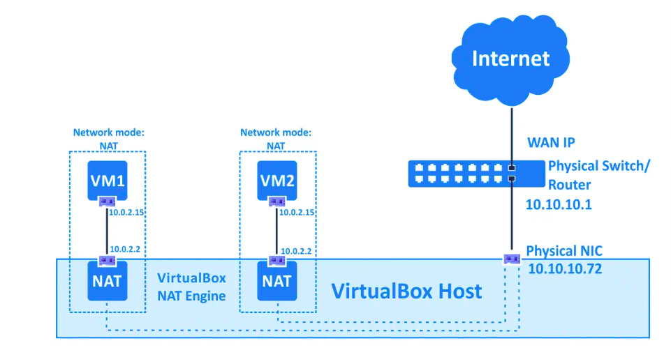
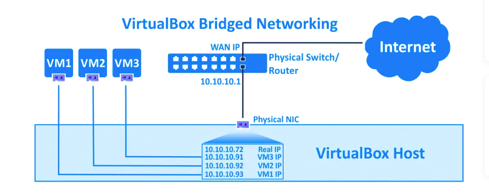
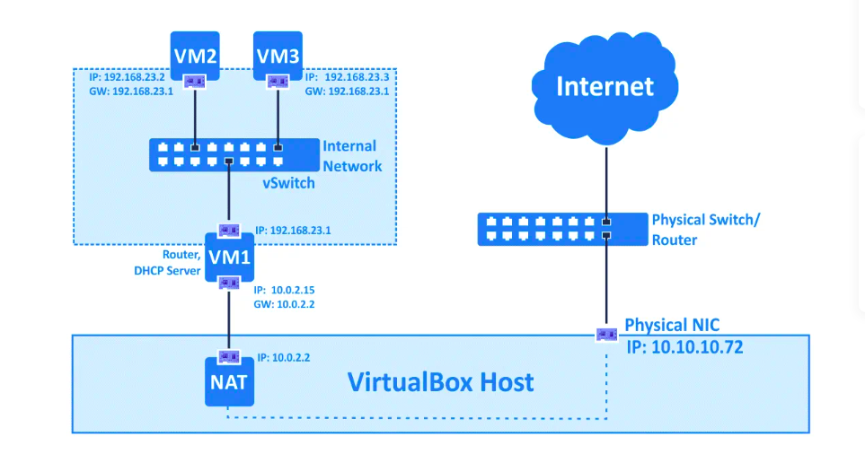

# VirtualBox Network Modes with Vagrant

This project was inspired by the excelent [blog](https://www.nakivo.com/blog/virtualbox-network-setting-guide/) on VirtualBox Network Modes by the Nakivo Team. We revisit he network settings explored in that post through a series of Labs. Each Lab define its set of VMs using Vagrant instead of the VirtualBox GUI.

## Labs Overview

Each Lab for a given Network Mode is comprised of:

- A _Vagranfile_ configuration
- A _Lab Guide_ with a set of experiments and detailed discussions.

## Network Modes Covered:

### NAT (See [Vagrantfile](NAT/Vagrantfile) and [Lab Guide](NAT/LAB-GUIDE.md))

This network mode is enabled for a virtual network adapter by default. A guest operating system on a VM can access hosts in a physical local area network (LAN) by using a virtual NAT (Network Address Translation) device. External networks, including the internet, are accessible from a guest OS. A guest machine is not accessible from a host machine, or from other machines in the network when the NAT mode is used for VirtualBox networking. This default network mode is sufficient for users who wish to use a VM just for internet access, for example.

The IP address of the VM network adapter is obtained via DHCP and the IP addresses of the network used in this network mode cannot be changed in the GUI. VirtualBox has a built-in DHCP server and NAT engine. A virtual NAT device uses the physical network adapter of the VirtualBox host as an external network interface. The default address of the virtual DHCP server used in the NAT mode is 10.0.2.2 (this is also the IP address of the default gateway for a VM). The network mask is 255.255.255.0.

### Bridged (See [Vagrantfile](Bridged/Vagrantfile) and [Lab Guide](Bridged/LAB-GUIDE.md))

This mode is used for connecting the virtual network adapter of a VM to a physical network to which a physical network adapter of the VirtualBox host machine is connected. A VM virtual network adapter uses the host network interface for a network connection. Put simply, network packets are sent and received directly from/to the virtual network adapter without additional routing. A special net filter driver is used by VirtualBox for a bridged network mode in order to filter data from the physical network adapter of the host.

This network mode can be used to run servers on VMs that must be fully accessible from a physical local area network. When using the bridged network mode in VirtualBox, you can access a host machine, hosts of the physical network and external networks, including internet from a VM. The VM can be accessed from the host machine and from other hosts (and VMs) connected to the physical network.

### Internal Network

Virtual machines whose adapters are configured to work in the VirtualBox Internal Network mode are connected to an isolated virtual network. VMs connected to this network can communicate with each other, but they cannot communicate with a VirtualBox host machine, or with any other hosts in a physical network or in external networks. VMs connected to the internal network cannot be accessed from a host or any other devices. The VirtualBox internal network can be used for modelling real networks.

Because the internal network is entirely isolated and lacks inherent access to external networks or the host, a router or jump host machine is necessary to provide connectivity to the outside world. A router machine, often a VM running pfSense or a Linux distribution with IP forwarding enabled, can be connected to the internal network with one adapter and to a NAT/Bridged network with another, acting as a gateway that routes traffic from the isolated network to the internet.

